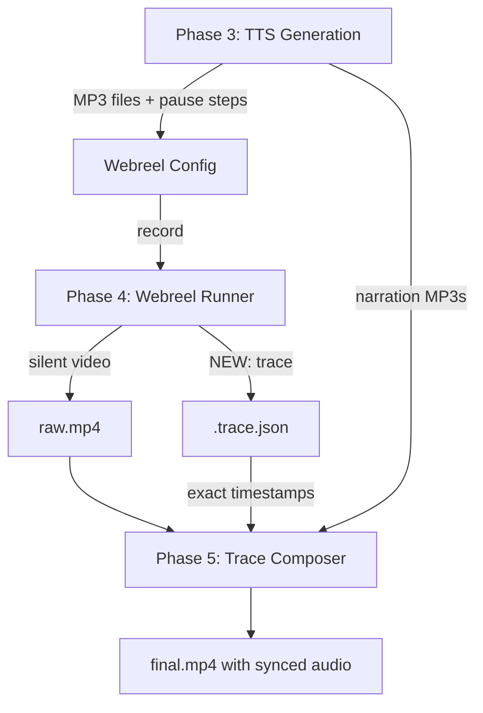

# Trace-Driven Audio Sync: Walkthrough

## Problem

The old audio sync approach **guessed** action durations (navigate=5s, click=3.5s) to calculate when each narration audio should start. This always diverged from reality (10-128%) because network latency, CDP stutter, and element resolution delays are unpredictable.

## Solution

**Let Webreel tell us the truth.** Instead of guessing timestamps, we modified Webreel to log the exact wall-clock time of every step execution, then use those real timestamps to place audio in MoviePy.

## Changes Made

### 1. Webreel Core: Execution Trace

```diff:runner.ts
import { resolve, dirname } from "node:path";
import { readFileSync, writeFileSync, mkdirSync } from "node:fs";
import { pathToFileURL } from "node:url";
import {
  type CDPClient,
  type BoundingBox,
  type OverlayTheme,
  RecordingContext,
  connectCDP,
  connectCDPUrl,
  launchChrome,
  navigate,
  waitForSelector,
  waitForText,
  injectOverlays,
  pause,
  findElementByText,
  findElementBySelector,
  clickAt,
  pressKey,
  typeText,
  dragFromTo,
  moveCursorTo,
  captureScreenshot,
  Recorder,
  InteractionTimeline,
  compose,
  ensureFfmpeg,
  extractThumbnail,
  moveFileSync,
  DEFAULT_VIEWPORT_SIZE,
  buildElementExpression,
  waitForInteractive,
  injectType,
} from "@webreel/core";
import type { VideoConfig, Step, ElementTarget } from "./types.js";

export function formatStep(i: number, step: Step): string {
  const desc = "description" in step && step.description ? `: ${step.description}` : "";
  const formatSelector = (sel: string | string[] | undefined) => {
    if (!sel) return "";
    if (Array.isArray(sel)) {
      return sel.length === 1 ? sel[0] : `[${sel.map(s => `"${s}"`).join(' OR ')}]`;
    }
    return sel;
  };

  switch (step.action) {
    case "pause":
      return `[step ${i}] pause ${step.ms}ms${desc}`;
    case "click":
      return `[step ${i}] click ${step.text ? `text="${step.text}"` : `selector="${formatSelector(step.selector)}"`}${desc}`;
    case "key":
      return `[step ${i}] key "${step.key}"${desc}`;
    case "type":
      return `[step ${i}] type "${step.text}"${step.selector ? ` selector="${formatSelector(step.selector)}"` : ""}${desc}`;
    case "scroll":
      return `[step ${i}] scroll x=${step.x ?? 0} y=${step.y ?? 0}${desc}`;
    case "wait":
      return `[step ${i}] wait ${step.selector ? `selector="${formatSelector(step.selector)}"` : `text="${step.text}"`}${desc}`;
    case "drag":
      return `[step ${i}] drag${desc}`;
    case "moveTo":
      return `[step ${i}] moveTo ${step.text ? `text="${step.text}"` : `selector="${formatSelector(step.selector)}"`}${desc}`;
    case "screenshot":
      return `[step ${i}] screenshot "${step.output}"${desc}`;
    case "navigate":
      return `[step ${i}] navigate "${step.url}"${desc}`;
    case "hover":
      return `[step ${i}] hover ${step.text ? `text="${step.text}"` : `selector="${formatSelector(step.selector)}"`}${desc}`;
    case "select":
      return `[step ${i}] select "${step.selector}" value="${step.value}"${desc}`;
    case "inject_type":
      return `[step ${i}] inject_type "${step.text}"${step.selector ? ` selector="${formatSelector(step.selector)}"` : ""}${desc}`;
    default: {
      const _exhaustive: never = step;
      return `[step ${i}] ${(_exhaustive as Step).action}`;
    }
  }
}

export function resolveKeyTarget(target: string | ElementTarget): string | string[] {
  if (typeof target === "string") return target;
  return target.selector ?? "";
}

async function resolveTarget(
  client: CDPClient,
  opts: { text?: string; selector?: string | string[]; within?: string },
  timeoutMs = 5000,
): Promise<{ box: BoundingBox; matchedSelector?: string }> {
  if (!opts.text && !opts.selector) {
    throw new Error(`resolveTarget requires "text" or "selector"`);
  }
  
  const start = Date.now();
  let box: BoundingBox | null = null;
  let matchedSelector: string | undefined;

  while (Date.now() - start < timeoutMs) {
    if (opts.text) {
      box = await findElementByText(client, opts.text, opts.within);
    } else if (opts.selector) {
      const selectors = Array.isArray(opts.selector) ? opts.selector : [opts.selector];
      for (const sel of selectors) {
        box = await findElementBySelector(client, sel, opts.within);
        if (box) {
          matchedSelector = sel;
          break;
        }
      }
    }
    if (box) break;
    await new Promise((r) => setTimeout(r, 100));
  }

  if (!box) {
    let target: string;
    if (opts.text) {
      target = `text="${opts.text}"`;
    } else if (Array.isArray(opts.selector)) {
      target = `selectors=[${opts.selector.map(s => `"${s}"`).join(', ')}] (tried all, none matched)`;
    } else {
      target = `selector="${opts.selector}"`;
    }
    const scope = opts.within ? ` within "${opts.within}"` : "";
    throw new Error(`Element not found: ${target}${scope}`);
  }
  return { box, matchedSelector };
}

export function resolveUrl(url: string, baseUrl: string, configDir: string): string {
  if (url.startsWith("http") || url.startsWith("file://")) return url;
  const combined = `${baseUrl}${url}`;
  if (combined.startsWith("http") || combined.startsWith("file://")) return combined;
  return pathToFileURL(resolve(configDir, combined)).href;
}

export function randomPointInBox(
  box: BoundingBox,
  spread = 0.25,
): { x: number; y: number } {
  const center = 0.5 - spread / 2;
  return {
    x: box.x + box.width * (center + Math.random() * spread),
    y: box.y + box.height * (center + Math.random() * spread),
  };
}

export async function extractThumbnailIfConfigured(
  config: Pick<VideoConfig, "thumbnail">,
  outputPath: string,
): Promise<void> {
  if (config.thumbnail?.enabled === false) return;
  const thumbTime = config.thumbnail?.time ?? 0;
  const thumbPath = outputPath.replace(/\.[^.]+$/, ".png");
  const ffmpegPath = await ensureFfmpeg();
  extractThumbnail(ffmpegPath, outputPath, thumbPath, thumbTime);
  console.log(`Thumbnail: ${thumbPath}`);
}

export interface RunVideoOptions {
  record?: boolean;
  verbose?: boolean;
  configDir?: string;
  frames?: boolean;
}

export async function runVideo(
  config: VideoConfig,
  options?: RunVideoOptions,
): Promise<void> {
  const shouldRecord = options?.record ?? true;
  const verbose = options?.verbose ?? false;
  const saveFrames = options?.frames ?? false;
  const configDir = options?.configDir ?? process.cwd();

  console.log(`${shouldRecord ? "Recording" : "Previewing"}: ${config.name}`);

  const width = config.viewport?.width ?? DEFAULT_VIEWPORT_SIZE;
  const height = config.viewport?.height ?? DEFAULT_VIEWPORT_SIZE;
  const zoom = config.zoom ?? 1;
  const cssWidth = Math.round(width / zoom);
  const cssHeight = Math.round(height / zoom);

  const ctx = new RecordingContext();
  ctx.resetCursorPosition(cssWidth, cssHeight);
  if (config.clickDwell !== undefined) ctx.setClickDwell(config.clickDwell);
  const initialCursor = ctx.getCursorPosition();

  const chrome = await launchChrome({ 
    headless: shouldRecord,
    profile: config.profile,
    cdpUrl: config.cdpUrl,
  });
  let clientRef: CDPClient | null = null;
  let recorder: Recorder | null = null;

  try {
    const client = config.cdpUrl ? await connectCDPUrl(config.cdpUrl) : await connectCDP(chrome.port);
    clientRef = client;
    await client.Page.enable();
    await client.Runtime.enable();
    await client.Emulation.setDeviceMetricsOverride({
      width: cssWidth,
      height: cssHeight,
      deviceScaleFactor: zoom,
      mobile: false,
    });

    const baseUrl = config.baseUrl ?? "";
    const url = resolveUrl(config.url, baseUrl, configDir);

    // Stealth Evasions
    const stealthScript = `
      // Overwrite the webdriver property
      Object.defineProperty(navigator, 'webdriver', {
        get: () => false,
      });
      // Mock chrome object
      window.chrome = {
        runtime: {},
        // etc
      };
      // Pass permissions
      const originalQuery = window.navigator.permissions.query;
      window.navigator.permissions.query = (parameters) => (
        parameters.name === 'notifications' ?
          Promise.resolve({ state: Notification.permission } as PermissionStatus) :
          originalQuery(parameters)
      );
    `;
    await client.Page.addScriptToEvaluateOnNewDocument({ source: stealthScript });

    await navigate(client, url);

    if (config.waitFor) {
      if (typeof config.waitFor === "string") {
        await waitForSelector(client, config.waitFor);
      } else if (config.waitFor.selector) {
        await waitForSelector(client, config.waitFor.selector, 30000, config.waitFor.within);
      } else if (config.waitFor.text) {
        await waitForText(client, config.waitFor.text, config.waitFor.within);
      }
    }

    await pause(200);

    let overlayTheme: OverlayTheme | undefined;
    let cursorSvg: string | undefined;
    const cursorConfig = config.theme?.cursor;
    if (config.theme) {
      overlayTheme = {
        cursorSize: cursorConfig?.size,
        cursorHotspot: cursorConfig?.hotspot,
        hud: config.theme.hud,
      };
      if (cursorConfig?.image) {
        try {
          cursorSvg = readFileSync(resolve(configDir, cursorConfig.image), "utf-8");
          overlayTheme.cursorSvg = cursorSvg;
        } catch {
          throw new Error(
            `Failed to read cursor SVG: ${resolve(configDir, cursorConfig.image)}`,
          );
        }
      }
    }

    let timeline: InteractionTimeline | null = null;
    const outputPath =
      config.output ?? resolve(configDir, "videos", `${config.name}.mp4`);

    if (shouldRecord) {
      ctx.setMode("record");
      timeline = new InteractionTimeline(width, height, {
        zoom,
        fps: config.fps,
        initialCursor,
        cursorSvg,
        cursorSize: cursorConfig?.size,
        cursorHotspot: cursorConfig?.hotspot,
        hud: config.theme?.hud,
      });
      ctx.setTimeline(timeline);

      const crf =
        config.quality !== undefined
          ? Math.round(51 * (1 - config.quality / 100))
          : undefined;
      const framesDir = saveFrames
        ? resolve(configDir, ".webreel", "frames", config.name)
        : undefined;
      recorder = new Recorder(width, height, {
        fps: config.fps,
        crf,
        framesDir,
        sfx: config.sfx,
      });
      recorder.setTimeline(timeline);
      await recorder.start(client, outputPath, ctx);
    } else {
      ctx.setMode("preview");
      ctx.setTimeline(null);
      await injectOverlays(client, overlayTheme, initialCursor);
    }

    await pause(500);

    for (let i = 0; i < config.steps.length; i++) {
      const step = config.steps[i];
      if (verbose) console.log(formatStep(i, step));

      try {
        switch (step.action) {
          case "pause":
            await pause(step.ms);
            break;

          case "click": {
            const { box } = await resolveTarget(client, step);
            await waitForInteractive(client, box);
            const { x: cx, y: cy } = randomPointInBox(box);
            await clickAt(ctx, client, cx, cy, step.modifiers);
            break;
          }

          case "key": {
            if (step.target) {
              const sel = resolveKeyTarget(step.target);
              if (sel) {
                const { matchedSelector } = await resolveTarget(client, { selector: sel });
                const expr = buildElementExpression(matchedSelector || (Array.isArray(sel) ? sel[0] : sel));
                await client.Runtime.evaluate({
                  expression: `${expr}?.focus()`,
                });
                await pause(100);
              }
            }
            await pressKey(ctx, client, step.key, step.label);
            break;
          }

          case "drag": {
            const { box: fromBox } = await resolveTarget(client, step.from);
            const { box: toBox } = await resolveTarget(client, step.to);
            await dragFromTo(ctx, client, fromBox, toBox);
            break;
          }

          case "type": {
            if (step.selector) {
              const { box, matchedSelector } = await resolveTarget(client, { selector: step.selector, within: step.within });
              await waitForInteractive(client, box);
              const { x: tx, y: ty } = randomPointInBox(box);
              await clickAt(ctx, client, tx, ty);
              
              const expr = buildElementExpression(matchedSelector || (Array.isArray(step.selector) ? step.selector[0] : step.selector), step.within);
              await client.Runtime.evaluate({
                expression: `(() => {
                  const el = ${expr};
                  if (el) {
                    el.focus();
                    el.dispatchEvent(new Event('focus', { bubbles: true }));
                  }
                })()`,
              });
              await pause(100 + Math.random() * 50); // Small realistic delay before typing
            }
            await typeText(ctx, client, step.text, step.charDelay);
            break;
          }

          case "scroll": {
            const scrollX = step.x ?? 0;
            const scrollY = step.y ?? 0;
            if (step.selector) {
              const { matchedSelector } = await resolveTarget(client, { selector: step.selector, within: step.within });
              const expr = buildElementExpression(matchedSelector || (Array.isArray(step.selector) ? step.selector[0] : step.selector), step.within);
              await client.Runtime.evaluate({
                expression: `(() => {
                  const target = ${expr};
                  if (target) target.scrollBy({ left: ${scrollX}, top: ${scrollY}, behavior: "smooth" });
                })()`,
              });
            } else if (step.text) {
              const { box } = await resolveTarget(client, step);
              await client.Runtime.evaluate({
                expression: `(() => {
                  const el = document.elementFromPoint(${Math.round(box.x + box.width / 2)}, ${Math.round(box.y + box.height / 2)});
                  if (el) el.scrollBy({ left: ${scrollX}, top: ${scrollY}, behavior: "smooth" });
                })()`,
              });
            } else {
              await client.Runtime.evaluate({
                expression: `window.scrollBy({ left: ${scrollX}, top: ${scrollY}, behavior: "smooth" })`,
              });
            }
            await pause(500);
            break;
          }

          case "wait": {
            if (step.selector) {
              await waitForSelector(client, step.selector, step.timeout, step.within);
            } else if (step.text) {
              await waitForText(client, step.text, step.within, step.timeout);
            }
            break;
          }

          case "screenshot": {
            await captureScreenshot(client, resolve(configDir, step.output));
            break;
          }

          case "moveTo": {
            const { box } = await resolveTarget(client, step);
            const { x: mx, y: my } = randomPointInBox(box, 0.1);
            await moveCursorTo(ctx, client, mx, my);
            break;
          }

          case "navigate": {
            const navUrl = resolveUrl(step.url, config.baseUrl ?? "", configDir);
            await navigate(client, navUrl);
            break;
          }

          case "hover": {
            const { box } = await resolveTarget(client, step);
            const { x: hx, y: hy } = randomPointInBox(box, 0.1);
            await moveCursorTo(ctx, client, hx, hy);
            await client.Input.dispatchMouseEvent({
              type: "mouseMoved",
              x: hx,
              y: hy,
            });
            break;
          }

          case "select": {
            if (step.selector) {
              const { matchedSelector } = await resolveTarget(client, { selector: step.selector, within: step.within });
              const expr = buildElementExpression(matchedSelector || (Array.isArray(step.selector) ? step.selector[0] : step.selector), step.within);
              await client.Runtime.evaluate({
                expression: `(() => {
                  const el = ${expr};
                  if (!el) throw new Error("Element not found: " + ${JSON.stringify(step.selector)});
                  el.value = ${JSON.stringify(step.value)};
                  el.dispatchEvent(new Event("input", { bubbles: true }));
                  el.dispatchEvent(new Event("change", { bubbles: true }));
                })()`,
              });
            } else if (step.text) {
              const { box } = await resolveTarget(client, step);
              await client.Runtime.evaluate({
                expression: `(() => {
                  const el = document.elementFromPoint(${Math.round(box.x + box.width / 2)}, ${Math.round(box.y + box.height / 2)});
                  if (!el) throw new Error("Element not found by text: " + ${JSON.stringify(step.text)});
                  el.value = ${JSON.stringify(step.value)};
                  el.dispatchEvent(new Event("input", { bubbles: true }));
                  el.dispatchEvent(new Event("change", { bubbles: true }));
                })()`,
              });
            } else {
              throw new Error(`select step requires "selector" or "text"`);
            }
            break;
          }

          case "inject_type": {
            await injectType(ctx, client, step.text, step.selector, step.within);
            break;
          }
        }
        const stepDelay = "delay" in step ? step.delay : undefined;
        const postDelay = stepDelay ?? config.defaultDelay;
        if (postDelay !== undefined && postDelay > 0) {
          await pause(postDelay);
        }
      } catch (err) {
        throw new Error(
          `Step ${i} (${step.action}) failed at ${url}: ${err instanceof Error ? err.message : String(err)}`,
          { cause: err },
        );
      }
    }

    if (recorder) {
      const cleanVideoPath = recorder.getTempVideoPath();
      await recorder.stop();
      recorder = null;

      if (timeline) {
        const timelineData = timeline.toJSON();
        const metadataDir = resolve(configDir, ".webreel", "timelines");
        mkdirSync(metadataDir, { recursive: true });
        writeFileSync(
          resolve(metadataDir, `${config.name}.timeline.json`),
          JSON.stringify(timelineData),
        );

        const rawDir = resolve(configDir, ".webreel", "raw");
        mkdirSync(rawDir, { recursive: true });
        const rawVideoPath = resolve(rawDir, `${config.name}.mp4`);
        moveFileSync(cleanVideoPath, rawVideoPath);

        ctx.setMode("preview");
        ctx.setTimeline(null);
        mkdirSync(dirname(outputPath), { recursive: true });
        console.log(`Compositing overlays...`);
        await compose(rawVideoPath, timelineData, outputPath, { sfx: config.sfx });
      }
      await extractThumbnailIfConfigured(config, outputPath);

      console.log(`Done: ${outputPath}`);
    } else {
      console.log(`Preview complete: ${config.name}`);
    }
  } finally {
    if (recorder) {
      try {
        await recorder.stop();
      } catch (err) {
        console.warn("Failed to stop recorder:", err);
      }
    }
    if (clientRef) {
      try {
        await clientRef.close();
      } catch (err) {
        console.warn("Failed to close CDP client:", err);
      }
    }
    if (!config.cdpUrl) {
      try {
        chrome.kill();
      } catch (err) {
        console.warn("Failed to kill Chrome process:", err);
      }
    }
  }
}
===
import { resolve, dirname } from "node:path";
import { readFileSync, writeFileSync, mkdirSync } from "node:fs";
import { pathToFileURL } from "node:url";
import {
  type CDPClient,
  type BoundingBox,
  type OverlayTheme,
  RecordingContext,
  connectCDP,
  connectCDPUrl,
  launchChrome,
  navigate,
  waitForSelector,
  waitForText,
  injectOverlays,
  pause,
  findElementByText,
  findElementBySelector,
  clickAt,
  pressKey,
  typeText,
  dragFromTo,
  moveCursorTo,
  captureScreenshot,
  Recorder,
  InteractionTimeline,
  compose,
  ensureFfmpeg,
  extractThumbnail,
  moveFileSync,
  DEFAULT_VIEWPORT_SIZE,
  buildElementExpression,
  waitForInteractive,
  injectType,
} from "@webreel/core";
import type { VideoConfig, Step, ElementTarget } from "./types.js";

export function formatStep(i: number, step: Step): string {
  const desc = "description" in step && step.description ? `: ${step.description}` : "";
  const formatSelector = (sel: string | string[] | undefined) => {
    if (!sel) return "";
    if (Array.isArray(sel)) {
      return sel.length === 1 ? sel[0] : `[${sel.map(s => `"${s}"`).join(' OR ')}]`;
    }
    return sel;
  };

  switch (step.action) {
    case "pause":
      return `[step ${i}] pause ${step.ms}ms${desc}`;
    case "click":
      return `[step ${i}] click ${step.text ? `text="${step.text}"` : `selector="${formatSelector(step.selector)}"`}${desc}`;
    case "key":
      return `[step ${i}] key "${step.key}"${desc}`;
    case "type":
      return `[step ${i}] type "${step.text}"${step.selector ? ` selector="${formatSelector(step.selector)}"` : ""}${desc}`;
    case "scroll":
      return `[step ${i}] scroll x=${step.x ?? 0} y=${step.y ?? 0}${desc}`;
    case "wait":
      return `[step ${i}] wait ${step.selector ? `selector="${formatSelector(step.selector)}"` : `text="${step.text}"`}${desc}`;
    case "drag":
      return `[step ${i}] drag${desc}`;
    case "moveTo":
      return `[step ${i}] moveTo ${step.text ? `text="${step.text}"` : `selector="${formatSelector(step.selector)}"`}${desc}`;
    case "screenshot":
      return `[step ${i}] screenshot "${step.output}"${desc}`;
    case "navigate":
      return `[step ${i}] navigate "${step.url}"${desc}`;
    case "hover":
      return `[step ${i}] hover ${step.text ? `text="${step.text}"` : `selector="${formatSelector(step.selector)}"`}${desc}`;
    case "select":
      return `[step ${i}] select "${step.selector}" value="${step.value}"${desc}`;
    case "inject_type":
      return `[step ${i}] inject_type "${step.text}"${step.selector ? ` selector="${formatSelector(step.selector)}"` : ""}${desc}`;
    default: {
      const _exhaustive: never = step;
      return `[step ${i}] ${(_exhaustive as Step).action}`;
    }
  }
}

export function resolveKeyTarget(target: string | ElementTarget): string | string[] {
  if (typeof target === "string") return target;
  return target.selector ?? "";
}

async function resolveTarget(
  client: CDPClient,
  opts: { text?: string; selector?: string | string[]; within?: string },
  timeoutMs = 5000,
): Promise<{ box: BoundingBox; matchedSelector?: string }> {
  if (!opts.text && !opts.selector) {
    throw new Error(`resolveTarget requires "text" or "selector"`);
  }
  
  const start = Date.now();
  let box: BoundingBox | null = null;
  let matchedSelector: string | undefined;

  while (Date.now() - start < timeoutMs) {
    if (opts.text) {
      box = await findElementByText(client, opts.text, opts.within);
    } else if (opts.selector) {
      const selectors = Array.isArray(opts.selector) ? opts.selector : [opts.selector];
      for (const sel of selectors) {
        box = await findElementBySelector(client, sel, opts.within);
        if (box) {
          matchedSelector = sel;
          break;
        }
      }
    }
    if (box) break;
    await new Promise((r) => setTimeout(r, 100));
  }

  if (!box) {
    let target: string;
    if (opts.text) {
      target = `text="${opts.text}"`;
    } else if (Array.isArray(opts.selector)) {
      target = `selectors=[${opts.selector.map(s => `"${s}"`).join(', ')}] (tried all, none matched)`;
    } else {
      target = `selector="${opts.selector}"`;
    }
    const scope = opts.within ? ` within "${opts.within}"` : "";
    throw new Error(`Element not found: ${target}${scope}`);
  }
  return { box, matchedSelector };
}

export function resolveUrl(url: string, baseUrl: string, configDir: string): string {
  if (url.startsWith("http") || url.startsWith("file://")) return url;
  const combined = `${baseUrl}${url}`;
  if (combined.startsWith("http") || combined.startsWith("file://")) return combined;
  return pathToFileURL(resolve(configDir, combined)).href;
}

export function randomPointInBox(
  box: BoundingBox,
  spread = 0.25,
): { x: number; y: number } {
  const center = 0.5 - spread / 2;
  return {
    x: box.x + box.width * (center + Math.random() * spread),
    y: box.y + box.height * (center + Math.random() * spread),
  };
}

export async function extractThumbnailIfConfigured(
  config: Pick<VideoConfig, "thumbnail">,
  outputPath: string,
): Promise<void> {
  if (config.thumbnail?.enabled === false) return;
  const thumbTime = config.thumbnail?.time ?? 0;
  const thumbPath = outputPath.replace(/\.[^.]+$/, ".png");
  const ffmpegPath = await ensureFfmpeg();
  extractThumbnail(ffmpegPath, outputPath, thumbPath, thumbTime);
  console.log(`Thumbnail: ${thumbPath}`);
}

export interface RunVideoOptions {
  record?: boolean;
  verbose?: boolean;
  configDir?: string;
  frames?: boolean;
}

export async function runVideo(
  config: VideoConfig,
  options?: RunVideoOptions,
): Promise<void> {
  const shouldRecord = options?.record ?? true;
  const verbose = options?.verbose ?? false;
  const saveFrames = options?.frames ?? false;
  const configDir = options?.configDir ?? process.cwd();

  console.log(`${shouldRecord ? "Recording" : "Previewing"}: ${config.name}`);

  const width = config.viewport?.width ?? DEFAULT_VIEWPORT_SIZE;
  const height = config.viewport?.height ?? DEFAULT_VIEWPORT_SIZE;
  const zoom = config.zoom ?? 1;
  const cssWidth = Math.round(width / zoom);
  const cssHeight = Math.round(height / zoom);

  const ctx = new RecordingContext();
  ctx.resetCursorPosition(cssWidth, cssHeight);
  if (config.clickDwell !== undefined) ctx.setClickDwell(config.clickDwell);
  const initialCursor = ctx.getCursorPosition();

  const chrome = await launchChrome({ 
    headless: shouldRecord,
    profile: config.profile,
    cdpUrl: config.cdpUrl,
  });
  let clientRef: CDPClient | null = null;
  let recorder: Recorder | null = null;

  try {
    const client = config.cdpUrl ? await connectCDPUrl(config.cdpUrl) : await connectCDP(chrome.port);
    clientRef = client;
    await client.Page.enable();
    await client.Runtime.enable();
    await client.Emulation.setDeviceMetricsOverride({
      width: cssWidth,
      height: cssHeight,
      deviceScaleFactor: zoom,
      mobile: false,
    });

    const baseUrl = config.baseUrl ?? "";
    const url = resolveUrl(config.url, baseUrl, configDir);

    // Stealth Evasions
    const stealthScript = `
      // Overwrite the webdriver property
      Object.defineProperty(navigator, 'webdriver', {
        get: () => false,
      });
      // Mock chrome object
      window.chrome = {
        runtime: {},
        // etc
      };
      // Pass permissions
      const originalQuery = window.navigator.permissions.query;
      window.navigator.permissions.query = (parameters) => (
        parameters.name === 'notifications' ?
          Promise.resolve({ state: Notification.permission } as PermissionStatus) :
          originalQuery(parameters)
      );
    `;
    await client.Page.addScriptToEvaluateOnNewDocument({ source: stealthScript });

    await navigate(client, url);

    if (config.waitFor) {
      if (typeof config.waitFor === "string") {
        await waitForSelector(client, config.waitFor);
      } else if (config.waitFor.selector) {
        await waitForSelector(client, config.waitFor.selector, 30000, config.waitFor.within);
      } else if (config.waitFor.text) {
        await waitForText(client, config.waitFor.text, config.waitFor.within);
      }
    }

    await pause(200);

    let overlayTheme: OverlayTheme | undefined;
    let cursorSvg: string | undefined;
    const cursorConfig = config.theme?.cursor;
    if (config.theme) {
      overlayTheme = {
        cursorSize: cursorConfig?.size,
        cursorHotspot: cursorConfig?.hotspot,
        hud: config.theme.hud,
      };
      if (cursorConfig?.image) {
        try {
          cursorSvg = readFileSync(resolve(configDir, cursorConfig.image), "utf-8");
          overlayTheme.cursorSvg = cursorSvg;
        } catch {
          throw new Error(
            `Failed to read cursor SVG: ${resolve(configDir, cursorConfig.image)}`,
          );
        }
      }
    }

    let timeline: InteractionTimeline | null = null;
    const outputPath =
      config.output ?? resolve(configDir, "videos", `${config.name}.mp4`);

    if (shouldRecord) {
      ctx.setMode("record");
      timeline = new InteractionTimeline(width, height, {
        zoom,
        fps: config.fps,
        initialCursor,
        cursorSvg,
        cursorSize: cursorConfig?.size,
        cursorHotspot: cursorConfig?.hotspot,
        hud: config.theme?.hud,
      });
      ctx.setTimeline(timeline);

      const crf =
        config.quality !== undefined
          ? Math.round(51 * (1 - config.quality / 100))
          : undefined;
      const framesDir = saveFrames
        ? resolve(configDir, ".webreel", "frames", config.name)
        : undefined;
      recorder = new Recorder(width, height, {
        fps: config.fps,
        crf,
        framesDir,
        sfx: config.sfx,
      });
      recorder.setTimeline(timeline);
      await recorder.start(client, outputPath, ctx);
    } else {
      ctx.setMode("preview");
      ctx.setTimeline(null);
      await injectOverlays(client, overlayTheme, initialCursor);
    }

    await pause(500);

    // Execution trace: record the real wall-clock time of every step
    const executionTrace: Array<{
      step_index: number;
      action_type: string;
      description?: string;
      start_time_ms: number;
      end_time_ms: number;
    }> = [];
    const recordingStartTime = Date.now();

    for (let i = 0; i < config.steps.length; i++) {
      const step = config.steps[i];
      if (verbose) console.log(formatStep(i, step));
      const stepStartMs = Date.now() - recordingStartTime;

      try {
        switch (step.action) {
          case "pause":
            await pause(step.ms);
            break;

          case "click": {
            const { box } = await resolveTarget(client, step);
            await waitForInteractive(client, box);
            const { x: cx, y: cy } = randomPointInBox(box);
            await clickAt(ctx, client, cx, cy, step.modifiers);
            break;
          }

          case "key": {
            if (step.target) {
              const sel = resolveKeyTarget(step.target);
              if (sel) {
                const { matchedSelector } = await resolveTarget(client, { selector: sel });
                const expr = buildElementExpression(matchedSelector || (Array.isArray(sel) ? sel[0] : sel));
                await client.Runtime.evaluate({
                  expression: `${expr}?.focus()`,
                });
                await pause(100);
              }
            }
            await pressKey(ctx, client, step.key, step.label);
            break;
          }

          case "drag": {
            const { box: fromBox } = await resolveTarget(client, step.from);
            const { box: toBox } = await resolveTarget(client, step.to);
            await dragFromTo(ctx, client, fromBox, toBox);
            break;
          }

          case "type": {
            if (step.selector) {
              const { box, matchedSelector } = await resolveTarget(client, { selector: step.selector, within: step.within });
              await waitForInteractive(client, box);
              const { x: tx, y: ty } = randomPointInBox(box);
              await clickAt(ctx, client, tx, ty);
              
              const expr = buildElementExpression(matchedSelector || (Array.isArray(step.selector) ? step.selector[0] : step.selector), step.within);
              await client.Runtime.evaluate({
                expression: `(() => {
                  const el = ${expr};
                  if (el) {
                    el.focus();
                    el.dispatchEvent(new Event('focus', { bubbles: true }));
                  }
                })()`,
              });
              await pause(100 + Math.random() * 50); // Small realistic delay before typing
            }
            await typeText(ctx, client, step.text, step.charDelay);
            break;
          }

          case "scroll": {
            const scrollX = step.x ?? 0;
            const scrollY = step.y ?? 0;
            if (step.selector) {
              const { matchedSelector } = await resolveTarget(client, { selector: step.selector, within: step.within });
              const expr = buildElementExpression(matchedSelector || (Array.isArray(step.selector) ? step.selector[0] : step.selector), step.within);
              await client.Runtime.evaluate({
                expression: `(() => {
                  const target = ${expr};
                  if (target) target.scrollBy({ left: ${scrollX}, top: ${scrollY}, behavior: "smooth" });
                })()`,
              });
            } else if (step.text) {
              const { box } = await resolveTarget(client, step);
              await client.Runtime.evaluate({
                expression: `(() => {
                  const el = document.elementFromPoint(${Math.round(box.x + box.width / 2)}, ${Math.round(box.y + box.height / 2)});
                  if (el) el.scrollBy({ left: ${scrollX}, top: ${scrollY}, behavior: "smooth" });
                })()`,
              });
            } else {
              await client.Runtime.evaluate({
                expression: `window.scrollBy({ left: ${scrollX}, top: ${scrollY}, behavior: "smooth" })`,
              });
            }
            await pause(500);
            break;
          }

          case "wait": {
            if (step.selector) {
              await waitForSelector(client, step.selector, step.timeout, step.within);
            } else if (step.text) {
              await waitForText(client, step.text, step.within, step.timeout);
            }
            break;
          }

          case "screenshot": {
            await captureScreenshot(client, resolve(configDir, step.output));
            break;
          }

          case "moveTo": {
            const { box } = await resolveTarget(client, step);
            const { x: mx, y: my } = randomPointInBox(box, 0.1);
            await moveCursorTo(ctx, client, mx, my);
            break;
          }

          case "navigate": {
            const navUrl = resolveUrl(step.url, config.baseUrl ?? "", configDir);
            await navigate(client, navUrl);
            break;
          }

          case "hover": {
            const { box } = await resolveTarget(client, step);
            const { x: hx, y: hy } = randomPointInBox(box, 0.1);
            await moveCursorTo(ctx, client, hx, hy);
            await client.Input.dispatchMouseEvent({
              type: "mouseMoved",
              x: hx,
              y: hy,
            });
            break;
          }

          case "select": {
            if (step.selector) {
              const { matchedSelector } = await resolveTarget(client, { selector: step.selector, within: step.within });
              const expr = buildElementExpression(matchedSelector || (Array.isArray(step.selector) ? step.selector[0] : step.selector), step.within);
              await client.Runtime.evaluate({
                expression: `(() => {
                  const el = ${expr};
                  if (!el) throw new Error("Element not found: " + ${JSON.stringify(step.selector)});
                  el.value = ${JSON.stringify(step.value)};
                  el.dispatchEvent(new Event("input", { bubbles: true }));
                  el.dispatchEvent(new Event("change", { bubbles: true }));
                })()`,
              });
            } else if (step.text) {
              const { box } = await resolveTarget(client, step);
              await client.Runtime.evaluate({
                expression: `(() => {
                  const el = document.elementFromPoint(${Math.round(box.x + box.width / 2)}, ${Math.round(box.y + box.height / 2)});
                  if (!el) throw new Error("Element not found by text: " + ${JSON.stringify(step.text)});
                  el.value = ${JSON.stringify(step.value)};
                  el.dispatchEvent(new Event("input", { bubbles: true }));
                  el.dispatchEvent(new Event("change", { bubbles: true }));
                })()`,
              });
            } else {
              throw new Error(`select step requires "selector" or "text"`);
            }
            break;
          }

          case "inject_type": {
            await injectType(ctx, client, step.text, step.selector, step.within);
            break;
          }
        }
        const stepDelay = "delay" in step ? step.delay : undefined;
        const postDelay = stepDelay ?? config.defaultDelay;
        if (postDelay !== undefined && postDelay > 0) {
          await pause(postDelay);
        }

        // Record step timing in execution trace
        const stepEndMs = Date.now() - recordingStartTime;
        executionTrace.push({
          step_index: i,
          action_type: step.action,
          description: "description" in step ? (step as { description?: string }).description : undefined,
          start_time_ms: stepStartMs,
          end_time_ms: stepEndMs,
        });
      } catch (err) {
        // Still record failed steps in trace
        const stepEndMs = Date.now() - recordingStartTime;
        executionTrace.push({
          step_index: i,
          action_type: step.action,
          description: "description" in step ? (step as { description?: string }).description : undefined,
          start_time_ms: stepStartMs,
          end_time_ms: stepEndMs,
        });
        throw new Error(
          `Step ${i} (${step.action}) failed at ${url}: ${err instanceof Error ? err.message : String(err)}`,
          { cause: err },
        );
      }
    }

    // Save execution trace
    {
      const traceDir = resolve(configDir, ".webreel", "traces");
      mkdirSync(traceDir, { recursive: true });
      writeFileSync(
        resolve(traceDir, `${config.name}.trace.json`),
        JSON.stringify(executionTrace, null, 2),
      );
      console.log(`Execution trace: ${resolve(traceDir, `${config.name}.trace.json`)}`);
    }

    if (recorder) {
      const cleanVideoPath = recorder.getTempVideoPath();
      await recorder.stop();
      recorder = null;

      if (timeline) {
        const timelineData = timeline.toJSON();
        const metadataDir = resolve(configDir, ".webreel", "timelines");
        mkdirSync(metadataDir, { recursive: true });
        writeFileSync(
          resolve(metadataDir, `${config.name}.timeline.json`),
          JSON.stringify(timelineData),
        );

        const rawDir = resolve(configDir, ".webreel", "raw");
        mkdirSync(rawDir, { recursive: true });
        const rawVideoPath = resolve(rawDir, `${config.name}.mp4`);
        moveFileSync(cleanVideoPath, rawVideoPath);

        ctx.setMode("preview");
        ctx.setTimeline(null);
        mkdirSync(dirname(outputPath), { recursive: true });
        console.log(`Compositing overlays...`);
        await compose(rawVideoPath, timelineData, outputPath, { sfx: config.sfx });
      }
      await extractThumbnailIfConfigured(config, outputPath);

      console.log(`Done: ${outputPath}`);
    } else {
      console.log(`Preview complete: ${config.name}`);
    }
  } finally {
    if (recorder) {
      try {
        await recorder.stop();
      } catch (err) {
        console.warn("Failed to stop recorder:", err);
      }
    }
    if (clientRef) {
      try {
        await clientRef.close();
      } catch (err) {
        console.warn("Failed to close CDP client:", err);
      }
    }
    if (!config.cdpUrl) {
      try {
        chrome.kill();
      } catch (err) {
        console.warn("Failed to kill Chrome process:", err);
      }
    }
  }
}
```

The step loop now records `Date.now()` before/after each step and saves a trace to `.webreel/traces/<name>.trace.json`:

```json
[
  {"step_index": 0, "action_type": "pause", "description": "[narration] ...", "start_time_ms": 520, "end_time_ms": 3200},
  {"step_index": 1, "action_type": "navigate", "start_time_ms": 3200, "end_time_ms": 5800},
  ...
]
```

### 2. New: Trace Composer

- **[trace_composer.py](file:///f:/==HK1-2526==/ThucTap/webreel/webreel-ai-agent/src/trace_composer.py)**: Reads trace JSON, finds `[narration]` pause steps, places audio at their exact `start_time_ms` using MoviePy.

### 3. Simplified: Audio Sync Optimizer

- **[audio_sync_optimizer_fixed.py](file:///f:/==HK1-2526==/ThucTap/webreel/webreel-ai-agent/src/audio_sync_optimizer_fixed.py)**: Removed all timeline estimation (`accumulated_time_ms`, page load wait guessing, AI timeline validation). Now only measures MP3 durations and injects pause steps.

### 4. Updated: Fixed Pipeline

- **[run_pipeline_unified_chrome_fixed.py](file:///f:/==HK1-2526==/ThucTap/webreel/webreel-ai-agent/run_pipeline_unified_chrome_fixed.py)**: Phase 5 now reads `.webreel/traces/<name>.trace.json` and uses [compose_video_from_trace()](file:///f:/==HK1-2526==/ThucTap/webreel/webreel-ai-agent/src/trace_composer.py#73-182) for exact audio placement. Falls back to old method if trace file is missing.

### 5. Test Script

- **[test_trace_composer.py](file:///f:/==HK1-2526==/ThucTap/webreel/webreel-ai-agent/test_trace_composer.py)**: Standalone CLI test with `--dry-run` mode.

## Test Results

### Trace Parser (synthetic data)
| Test | Result |
|------|--------|
| Load 7-entry trace | PASS |
| Find 3 narration pauses | PASS |
| Verify timestamps (0.52s, 6.10s, 12.50s) | PASS |
| Exclude non-narration pauses | PASS |

### Audio Optimizer (simplified)
| Test | Result |
|------|--------|
| 3 actions -> 6 steps (3 pauses + 3 actions) | PASS |
| Pause durations = audio_duration + 300ms | PASS |
| Narration descriptions start with `[narration]` | PASS |

### TypeScript Build
Compiled JS at [packages/webreel/dist/lib/runner.js](file:///f:/==HK1-2526==/ThucTap/webreel/packages/webreel/dist/lib/runner.js) contains `executionTrace` in 4 locations (declaration, 2 push calls, write call).

## How to Use

```bash
# Run the trace-driven pipeline
python run_pipeline_unified_chrome_fixed.py "Your task" --name my_video

# Or test trace composer standalone (after a Webreel recording)
python test_trace_composer.py --name my_video
python test_trace_composer.py --name my_video --dry-run  # parse-only
```

## Architecture Diagram



Kết quả thực tế:

- video ngắn: hoạt động ok
- video dài: hoạt động không được đúng lắm, segment đầu thì rất đúng nhưng các segment sau đọc liên tiếp nhau sau segment đầu, dự là xuất phát từ moviepy không thấy những gì được trace bên dưới
đây là folder tôi test đọc cấu hình xem đúng kh nhé webreel-ai-agent\output\trace-w3tes
video gốc có thời lượng 55s
video sau khi sync audio có thời lượng cũng 55s và trace nhìn sơ qua rất đúng, nhưng khi sync thì tình trạng như trên 
lệnh chạy là  venv\Scripts\python.exe run_pipeline_unified_chrome_fixed.py "Vào http://127.0.0.1:5500/webreel-ai-agent/test-cases/test-xpath-fallback.html ấn vào và điền thông tin vào 'go to form page, thông tin tự chọn, sau đó submit form, sau đó ấn view all data và cuối cùng là back go home'" --name trace-w3tes 