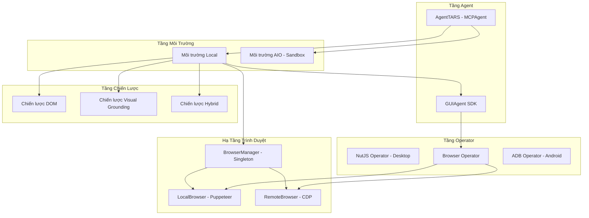

# Phân Tích: Dự Án ByteDance Computer Use (UI-TARS / Agent TARS)

## 1. Tổng Quan Dự Án

Đây là dự án **UI-TARS Desktop & Agent TARS** của ByteDance, một hệ thống agent tự động hóa giao diện người dùng (GUI) mã nguồn mở. Codebase (~46 nghìn dòng) là monorepo với giấy phép Apache-2.0, được tổ chức thành 5 tầng chính:

| Tầng | Package | Mục đích |
|------|---------|----------|
| **Tầng Ứng dụng** | `apps/ui-tars` | Ứng dụng Electron, định tuyến IPC, quản lý cửa sổ |
| **Agent Đa phương thức** | `multimodal/agent-tars` | Điều phối agent cấp cao với MCP (Model Context Protocol) |
| **GUI Agent SDK** | `multimodal/gui-agent/*` | Bộ phân tích hành động, các operator (NutJS/ADB/Browser), kiểu dữ liệu chung |
| **Hạ tầng Agent** | `packages/agent-infra/browser` | Quản lý trình duyệt cấp thấp (Local/Remote), bọc Puppeteer |
| **MCP Servers** | `packages/agent-infra/mcp-servers/browser` | MCP server cho công cụ trình duyệt, **có Dockerfile** |

---

## 2. Sơ Đồ Kiến Trúc



---

## 3. Phân Tích Các Thành Phần Chính

### 3.1. Quản Lý Trình Duyệt (`BrowserManager`)

**File**: `multimodal/agent-tars/core/src/environments/local/browser/browser-manager.ts`

`BrowserManager` là một **singleton** quản lý vòng đời trình duyệt:

```typescript
// Hai chế độ: LocalBrowser hoặc RemoteBrowser qua CDP
public getBrowser(): LocalBrowser | RemoteBrowser {
    if (this.lastLaunchOptions?.cdpEndpoint) {
        this.browser = new RemoteBrowser({
            cdpEndpoint: this.lastLaunchOptions.cdpEndpoint,
        });
    } else {
        this.browser = new LocalBrowser({ ... });
    }
}
```

> [!IMPORTANT]
> **Điểm quan trọng**: Dự án hỗ trợ hai chế độ trình duyệt:
> - **LocalBrowser**: Khởi chạy Chrome/Chromium cục bộ qua Puppeteer
> - **RemoteBrowser**: Kết nối tới trình duyệt đang chạy qua **CDP endpoint** (`cdpEndpoint`)
>
> Đây chính xác là kiến trúc mà WebReel đang dùng, nhưng họ còn hỗ trợ thêm tùy chọn `cdpEndpoint` để kết nối tới trình duyệt chạy trong Docker.

**Tính năng khôi phục tự động**: Khi trình duyệt crash, `BrowserManager` tự động phát hiện và tái khởi động:

```typescript
public async recoverBrowser(): Promise<boolean> {
    // Đóng trình duyệt cũ (bỏ qua lỗi)
    await this.browser.close().catch(() => {});
    // Tạo instance mới
    this.browser = new RemoteBrowser/LocalBrowser({ ... });
    // Khởi động lại với cấu hình cuối cùng
    await this.launchBrowser(this.lastLaunchOptions);
}
```

### 3.2. Remote Computer Operator và Sandbox

**File**: `apps/ui-tars/src/main/remote/operators.ts`

`RemoteComputerOperator` tiết lộ **kiến trúc sandbox** của họ:

```typescript
public static async create(): Promise<RemoteComputerOperator> {
    const sandbox = await ProxyClient.getSandboxInfo();
    this.currentInstance = new RemoteComputerOperator('free', sandbox, null);
}
```

Sandbox cung cấp các API:
- `takeScreenshot()` - chụp màn hình
- `clickMouse()` - nhấp chuột
- `dragMouse()` - kéo thả
- `typeText()` - gõ văn bản
- `pressKey()` - nhấn phím
- `scroll()` - cuộn trang
- `moveMouse()` - di chuyển chuột
- `getScreenSize()` - kích thước màn hình

> [!TIP]
> **Mô hình Sandbox**: Họ sử dụng sandbox dựa trên đám mây (`ProxyClient.getSandboxInfo()`) cung cấp một môi trường desktop ảo đầy đủ. Agent kết nối từ xa và điều khiển qua các cuộc gọi API. Đây thực chất là một **máy ảo trên cloud có IP thực và màn hình thực**, không phải Docker.

### 3.3. Chiến Lược Điều Khiển Trình Duyệt (Strategy Pattern)

**File**: `browser-control-strategies/strategy-factory.ts`

Ba chiến lược điều khiển trình duyệt:

| Chiến lược | Mô tả | Công cụ đăng ký |
|------------|-------|-----------------|
| **DOM** (`dom`) | Chỉ dùng công cụ MCP browser, không dùng thị giác | `browser_navigate`, `browser_click`, `browser_form_input_fill`, v.v. |
| **Visual Grounding** (`visual-grounding`) | Chỉ dùng GUI Agent (dựa trên thị giác) | `browser_vision_control` + công cụ điều hướng/nội dung tùy chỉnh |
| **Hybrid** (`hybrid`) | Kết hợp cả DOM + Visual | Tất cả công cụ trên |

> [!NOTE]
> **Điều đáng chú ý**: Chiến lược **Visual Grounding** điều khiển trình duyệt bằng cách chụp ảnh màn hình rồi để AI nhận diện vị trí cần click, tương tự cách mà `os_executor_v2.py` của bạn đang làm. Đây là phương pháp **khó bị phát hiện nhất** vì nó không cần CDP.

### 3.4. Mô Hình Môi Trường của Agent TARS

```typescript
const environment = processedOptions.aioSandbox
    ? new AgentTARSAIOEnvironment(...)    // Sandbox trên Cloud
    : new AgentTARSLocalEnvironment(...); // Máy cục bộ
```

`AgentTARSLocalEnvironment` xử lý:
- **Khởi động trình duyệt lười** (chỉ khi gọi công cụ `browser_*`)
- **Khôi phục trình duyệt** (tự động khởi động lại nếu crash)
- **MCP trong bộ nhớ** (server chạy trong process, không cần tiến trình riêng)
- **Phân giải đường dẫn workspace** (sandbox bảo mật cho truy cập file)

---

## 4. Những Gì WebReel Có Thể Học Hỏi

### 4.1. Docker và Vượt Qua Antibot

> [!CAUTION]
> **Tin xấu trước**: Dự án này **KHÔNG** chứa bất kỳ mã vượt qua antibot nào. Không có stealth plugin, không có giả mạo dấu vân tay (fingerprint), không có tránh phát hiện headless. Dự án dùng Puppeteer/Chromium nguyên bản.

Tuy nhiên, có nhiều **pattern kiến trúc** rất đáng học:

#### Pattern A: Kiến Trúc CDP Endpoint (có thể áp dụng)

Dự án dùng `RemoteBrowser` kết nối qua CDP endpoint:

```typescript
this.browser = new RemoteBrowser({
    cdpEndpoint: this.lastLaunchOptions.cdpEndpoint,
});
```

**Cách áp dụng cho Docker antibot bypass:**

```
+-------------------------------------------------------+
|  Docker Container (Mạng cách ly)                       |
|  +---------------------------------------------------+ |
|  | Chrome với:                                        | |
|  |  - Màn hình thực (Xvfb / virtual framebuffer)      | |
|  |  - Không có cờ --headless                          | |
|  |  - Không có cờ tự động hóa (automation flags)       | |
|  |  - puppeteer-extra-plugin-stealth                   | |
|  |  - user-data-dir tùy chỉnh với profile thật         | |
|  |  - Font thực, WebGL, Canvas fingerprint             | |
|  |  --remote-debugging-port=9222                       | |
|  +---------------------------------------------------+ |
|         ^                                               |
|         | CDP qua mạng Docker nội bộ                    |
|         | (127.0.0.1:9222 -> host qua port mapping)     |
+---------+-----------------------------------------------+
          |
    +-----v---------+
    | WebReel Agent  |
    | (Host)         |
    +----------------+
```

> [!WARNING]
> **Vấn đề hiện tại của bạn**: Khi chạy CDP trong Docker, hệ thống antibot phát hiện dấu vân tay mạng nội bộ. Bài học chính từ dự án này là họ **không chạy trình duyệt trong Docker để tự động hóa web**. Thay vào đó, họ:
> 1. Dùng **trình duyệt cục bộ** trên máy host
> 2. Kết nối tới **máy ảo sandbox trên cloud** (có IP thực và màn hình thực)

#### Pattern B: Sandbox Hệ Điều Hành Đầy Đủ (giải pháp thực sự)

Pattern `RemoteComputerOperator` là tiêu chuẩn vàng:

```
+------------------------------------------+
|  Máy ảo Cloud / VPS  (IP thực, Màn hình  |
|  thực)                                    |
|  - Ubuntu 22.04 + XFCE/LXDE              |
|  - Chrome (cài đặt bình thường)           |
|  - VNC/noVNC để truy cập trực quan       |
|  - Server API cho agent (chụp màn hình,   |
|    click, gõ phím, cuộn trang)            |
+------------------------------------------+
          ^
          | HTTP API hoặc WebSocket
          |
    +-----v---------+
    | WebReel Agent  |
    | (Ở bất kỳ đâu)|
    +----------------+
```

**Đây là phương pháp thực sự vượt qua antibot** vì:
- **Địa chỉ IP thực** (không phải mạng nội bộ Docker)
- **Máy chủ màn hình thực** (không có dấu vết virtual framebuffer)
- **Cài đặt trình duyệt thực** (không phải Chromium đi kèm Puppeteer)
- **Không bị phát hiện CDP** (agent điều khiển qua chuột/bàn phím cấp hệ điều hành, không dùng CDP)

### 4.2. Kiến Trúc Sandbox (Rất Có Giá Trị)

#### 4.2.1. Giao Diện API của Sandbox

Từ `RemoteComputerOperator`, sandbox lộ ra các API này:

```typescript
interface RemoteComputer {
    getScreenSize(): Promise<{width: number, height: number}>;
    takeScreenshot(): Promise<string>;  // base64
    clickMouse(x, y, button, ...): Promise<void>;
    dragMouse(startX, startY, endX, endY): Promise<void>;
    typeText(text: string): Promise<void>;
    pressKey(key: string): Promise<void>;
    moveMouse(x, y): Promise<void>;
    scroll(x, y, direction, amount): Promise<void>;
}
```

Đây chính xác là những gì `os_executor_v2.py` của bạn đã làm cục bộ. **Bước nhảy là biến nó thành API từ xa qua HTTP**.

#### 4.2.2. Cách Xây Dựng Sandbox Của Riêng Bạn

Dựa trên các pattern trong dự án này, đây là kế hoạch cụ thể:

**Docker Compose cho sandbox:**

```yaml
version: "3.8"
services:
  browser-sandbox:
    image: kasmweb/chrome:1.16.1
    # HOẶC tự xây dựng với ubuntu:22.04
    environment:
      - VNC_PW=matkhau_cua_ban
    ports:
      - "6901:6901"   # Truy cập noVNC web
      - "8765:8765"   # API điều khiển từ Agent
    shm_size: "2g"     # Tăng bộ nhớ chia sẻ cho Chrome
```

**Sandbox server (`sandbox_server.py`):**

```python
from fastapi import FastAPI
import pyautogui
import base64
from io import BytesIO

app = FastAPI()

@app.post("/screenshot")
async def screenshot():
    """Chụp màn hình và trả về base64"""
    img = pyautogui.screenshot()
    buffer = BytesIO()
    img.save(buffer, format="PNG")
    b64 = base64.b64encode(buffer.getvalue()).decode()
    return {"base64": b64, "width": img.width, "height": img.height}

@app.post("/click")
async def click(x: int, y: int, button: str = "left"):
    """Nhấp chuột tại vị trí cho trước"""
    pyautogui.click(x, y, button=button)
    return {"status": "success"}

@app.post("/type")
async def type_text(text: str):
    """Gõ văn bản"""
    pyautogui.typewrite(text, interval=0.05)
    return {"status": "success"}

@app.post("/drag")
async def drag(start_x: int, start_y: int, end_x: int, end_y: int):
    """Kéo thả từ điểm đầu tới điểm cuối"""
    pyautogui.moveTo(start_x, start_y)
    pyautogui.drag(end_x - start_x, end_y - start_y, duration=0.5)
    return {"status": "success"}

@app.post("/scroll")
async def scroll(x: int, y: int, direction: str, amount: int = 3):
    """Cuộn trang theo hướng chỉ định"""
    pyautogui.moveTo(x, y)
    clicks = amount if direction == "up" else -amount
    pyautogui.scroll(clicks)
    return {"status": "success"}

@app.post("/hotkey")
async def hotkey(keys: str):
    """Nhấn tổ hợp phím, ví dụ: ctrl+c"""
    key_list = keys.split("+")
    pyautogui.hotkey(*key_list)
    return {"status": "success"}
```

> [!NOTE]
> Phương pháp này **hoàn toàn né tránh vấn đề antibot** vì:
> - Không sử dụng giao thức CDP (antibot không thể phát hiện `navigator.webdriver`)
> - Trình duyệt được điều khiển qua nhập liệu cấp hệ điều hành, giống như người dùng thật
> - Màn hình thực, render thực, mạng thực từ góc độ của máy ảo

### 4.3. Browser Tools Manager và MCP Pattern

`BrowserToolsManager` với strategy pattern rất gọn gàng để tổ chức công cụ trình duyệt:

```typescript
const strategy = StrategyFactory.createStrategy(mode, logger);
const tools = await strategy.registerTools(registerToolFn);
```

**Bài học cho WebReel**: Nếu bạn muốn hỗ trợ nhiều chế độ điều khiển trình duyệt (CDP cho nhanh/headless, cấp hệ điều hành cho ẩn danh), bạn có thể áp dụng strategy pattern này trong Python:

```python
from abc import ABC, abstractmethod

class BrowserControlStrategy(ABC):
    @abstractmethod
    async def click(self, x: int, y: int): ...
    @abstractmethod
    async def screenshot(self) -> str: ...
    @abstractmethod
    async def type_text(self, text: str): ...

class CDPStrategy(BrowserControlStrategy):
    """Nhanh nhưng dễ bị phát hiện"""
    async def click(self, x, y):
        await self.page.mouse.click(x, y)

class OSLevelStrategy(BrowserControlStrategy):
    """Chậm hơn nhưng không thể phát hiện"""
    async def click(self, x, y):
        pyautogui.click(x, y)
```

### 4.4. Hệ Thống Phân Tích Hành Động (Action Parser)

`ActionParserHelper` cung cấp bộ phân tích mạnh mẽ để chuyển đổi đầu ra LLM thành hành động có cấu trúc:

```
Đầu vào:  "click(point='<point>510 150</point>')"
Đầu ra:   { type: "click", inputs: { point: { raw: {x: 510, y: 150} } } }
```

Hỗ trợ nhiều định dạng:
- `click(start_box='[x1, y1, x2, y2]')` (UI-TARS v1.0)
- `click(point='<point>x1 y1</point>')` (UI-TARS v1.5)
- `click(start_box='<bbox>x1 y1 x2 y2</bbox>')` (định dạng bbox)
- Định dạng XML với thẻ `<seed:tool_call>`
- Định dạng JSON function call của OpenAI

> [!TIP]
> Bộ phân tích này rất chín muồi và xử lý nhiều trường hợp đặc biệt (thẻ không đầy đủ, thiếu dấu nháy). Nếu bạn cần phân tích hành động GUI do LLM tạo ra, đây là mã tham khảo tuyệt vời.

---

## 5. Tóm Tắt và Đề Xuất

### Về Docker Antibot Bypass

| Phương pháp | Độ khó | Hiệu quả | Nên dùng? |
|-------------|--------|----------|-----------|
| CDP + stealth plugin trong Docker | Thấp | Thấp (vẫn bị phát hiện) | **Không** |
| Sandbox máy ảo đầy đủ (như `RemoteComputer` của họ) | Trung bình | Cao | **Có** |
| Docker image KasmWeb/browserless.io | Thấp-Trung bình | Trung bình-Cao | **Có** (giải pháp nhanh) |
| Cloudflare Workers + proxy dân cư | Thấp | Trung bình | Chỉ cho trường hợp đơn giản |

### Về Sandbox

| Tính năng từ dự án này | Tái sử dụng được? | Công sức |
|------------------------|-------------------|---------|
| Giao diện API `RemoteComputerOperator` | Chuyển trực tiếp sang Python | Thấp |
| Singleton `BrowserManager` với khôi phục tự động | Điều chỉnh cho Python | Thấp |
| Strategy Pattern cho điều khiển trình duyệt | Kiến trúc sạch | Trung bình |
| Action Parser (đa định dạng) | Chỉ tham khảo | Không cần |
| MCP in-memory server pattern | Thú vị nhưng quá phức tạp cho bạn | Không cần |

### Các Bước Tiếp Theo Cụ Thể

1. **Giải pháp nhanh**: Thử dùng [KasmWeb Chrome image](https://hub.docker.com/r/kasmweb/chrome) làm Docker sandbox. Nó cung cấp trình duyệt thực với truy cập VNC và màn hình thực. Agent của bạn có thể kết nối qua VNC + pyautogui.

2. **Trung hạn**: Xây dựng sandbox server theo pattern API `RemoteComputer` từ dự án này. Chạy nó trên VPS hiện có của bạn cùng với cấu hình Cloudflare.

3. **Kiến trúc**: Áp dụng pattern `BrowserControlStrategy` để hỗ trợ cả hai chế độ CDP (cho dev/nhanh) và cấp hệ điều hành (cho production/ẩn danh).

---

## 6. Liên Hệ Với Dự Án WebReel Hiện Tại

### So Sánh Kiến Trúc

| Thành phần | Dự án UI-TARS | WebReel hiện tại |
|------------|---------------|------------------|
| Điều khiển trình duyệt | Puppeteer (CDP) + Visual Grounding | browser-use (CDP) + os_executor (pyautogui) |
| Sandbox | Cloud VM qua ProxyClient | Docker (đang gặp vấn đề mạng nội bộ) |
| Vòng lặp Agent | MCP Agent với event stream | Pipeline với planning agent |
| Chụp màn hình | Puppeteer CDP hoặc cấp hệ điều hành | pyautogui + win32api |
| Hành động | Action Parser rồi Operator rồi Thực thi | Planning Agent rồi OS Executor |

### Điểm Mạnh Của WebReel So Với UI-TARS

- **Điều khiển cấp hệ điều hành** đã có sẵn (`os_executor_v2.py`) tương tự `NutJSOperator` của họ
- **Pipeline linh hoạt** hơn với tích hợp TTS và quay video
- **Vision adapter** tương tự `BrowserGUIAgent` của họ

### Điểm Cần Cải Thiện

- **Sandbox từ xa**: Cần xây dựng `RemoteSandboxExecutor` để chuyển từ local sang remote
- **Khôi phục tự động**: Cần thêm cơ chế tự động khôi phục khi trình duyệt crash (học từ `BrowserManager.recoverBrowser()`)
- **Strategy Pattern**: Tách riêng CDP và cấp hệ điều hành thành các strategy riêng biệt
