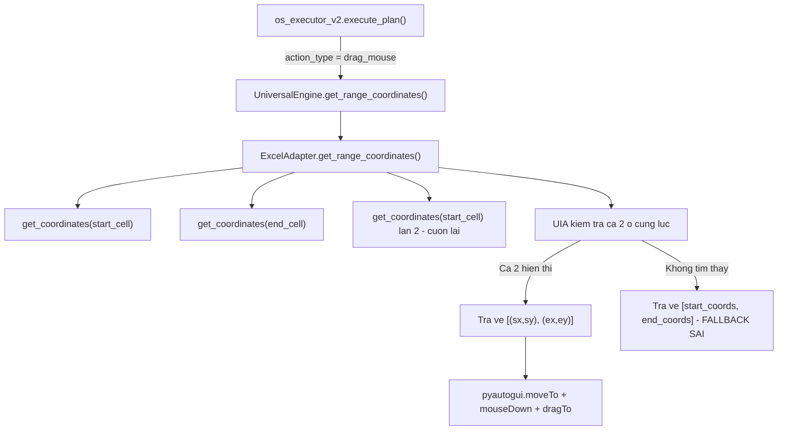

# Phan tich loi: Excel Drag (Boi den) that bai khi vung chon vuot ra ngoai man hinh

## Tom tat van de

Khi yeu cau "boi den" (drag select) mot dai o trong Excel ma **end_cell nam ngoai khung hinh hien tai**, he thong:
- **Phase Plan-Only** (do duong): Tinh toa do **thanh cong** (vi `get_coordinates` tu dong cuon Excel de tim o).
- **Phase Record** (quay video): **THAT BAI** - chuot khong keo duoc dung hoac drag ra toa do sai.

---

## Luong Du lieu (Data Flow)



---

## 3 Loi Chinh (Root Causes)

### Loi 1: `get_range_coordinates()` cuon man hinh lam mat toa do start_cell

> [!CAUTION]
> Day la loi NGHIEM TRONG NHAT.

Xem [excel_adapter.py:258-307](file:///f:/==HK1-2526==/ThucTap/webreel/webreel-ai-agent/os_recorder/core/excel_adapter.py#L258-L307):

```python
# Dong 259: Lay toa do start_cell (OK, o dang hien thi tren man hinh)
start_coords = self.get_coordinates(start_cell)  # VD: (500, 300)

# Dong 269: Lay toa do end_cell
# NHUNG! get_coordinates() se TU DONG CUON man hinh neu end_cell bi khuat!
# Sau khi cuon, start_cell co the DA BI KHUAT vi Excel da cuon xuong/sang phai
end_coords = self.get_coordinates(end_cell)  # VD: (800, 600) - SAU KHI CUON

# Dong 275: Cuon lai ve start_cell
self.get_coordinates(start_cell)
# Luc nay start_cell lai hien thi, NHUNG end_cell co the DA BI KHUAT NGUOC LAI!
```

**Van de**: Khi `start_cell = A1` va `end_cell = Z1` (rat xa sang phai):
1. `get_coordinates("A1")` -> `(500, 300)` - OK
2. `get_coordinates("Z1")` -> Excel cuon sang phai -> `Z1` o `(800, 300)` - nhung `A1` da KHUAT
3. `get_coordinates("A1")` -> Excel cuon lai trai -> `A1` o `(500, 300)` - nhung `Z1` da KHUAT LAI
4. Kiem tra UIA `cell_start_ui.Exists()` va `cell_end_ui.Exists()` -> **CA HAI KHONG THE CUNG HIEN THI** -> fail
5. Fallback tra ve `[start_coords, end_coords]` nhung **`end_coords` la toa do cua Z1 KHI MAN HINH DANG CUON SANG PHAI**, con bay gio man hinh da cuon lai trai -> **toa do sai hoan toan**

### Loi 2: Fallback `[start_coords, end_coords]` tra ve toa do KHONG dong bo

> [!WARNING]
> Toa do start va end duoc lay tai 2 thoi diem man hinh khac nhau!

```python
# Dong 307
return [start_coords, end_coords]
```

`start_coords` duoc lay khi man hinh o vi tri ban dau.
`end_coords` duoc lay khi man hinh DA CUON di.
Sau do man hinh lai cuon ve.

-> Ca hai toa do deu **KHONG DUNG** voi trang thai man hinh hien tai.

### Loi 3: `os_executor_v2` drag_mouse su dung `dragTo()` khong co co che cuon tu dong

Xem [os_executor_v2.py:296-311](file:///f:/==HK1-2526==/ThucTap/webreel/webreel-ai-agent/os_recorder/core/os_executor_v2.py#L296-L311):

```python
coords = engine.get_range_coordinates(target_value, target_pid)
if coords and len(coords) == 2:
    sx, sy = coords[0]
    ex, ey = coords[1]
    if not dry_run:
        pyautogui.moveTo(sx, sy, ...)
        pyautogui.mouseDown(button='left')
        pyautogui.dragTo(ex, ey, ...)  # <-- Keo thang toi toa do end
        pyautogui.mouseUp(button='left')
```

`pyautogui.dragTo(ex, ey)` chi di chuyen chuot toi toa do `(ex, ey)` tren man hinh. Neu `(ex, ey)` nam **ngoai vung hien thi cua Excel**, no se:
- Keo chuot ra ngoai cua so Excel -> khong boi den duoc
- Hoac keo vao mot vi tri ngau nhien tren man hinh

**pyautogui KHONG biet cach cuon Excel khi dang giu chuot**.

---

## Giai phap De xuat

### Giai phap A: Dung COM de Select truc tiep (Don gian nhat, hieu qua nhat)

Thay vi dung chuot de drag, dung COM `Range("A1:Z1").Select()` de Excel tu boi den. Sau do chi can di chuot "dien" animation cho video.

```python
# Trong ExcelAdapter, them method moi:
def select_range_via_com(self, range_address: str) -> bool:
    """Dung COM de Select vung o, Excel se tu hien thi boi den."""
    try:
        sheet = self._excel.ActiveSheet
        sheet.Range(range_address).Select()
        return True
    except:
        return False
```

Trong `os_executor_v2`, khi gap `drag_mouse` cho Excel:
1. Goi COM `Range.Select()` de boi den that
2. Di chuot animation tu start -> cuon -> end de "dien" cho video

**Uu diem**: Excel tu xu ly cuon, boi den chinh xac 100%.
**Nhuoc diem**: Tren video, co the hoi "gia" vi khong thay chuot keo thuc su.

### Giai phap B: Drag theo "Tung doan" voi cuon tu dong (Tu nhien hon tren video)

Chia dong tac drag thanh nhieu buoc nho:
1. Click start_cell, giu chuot
2. Keo tu tu sang phai/xuong duoi
3. Khi chuot cham bien cua so Excel -> Excel se TU DONG CUON (auto-scroll)
4. Tiep tuc keo cho toi khi end_cell xuat hien
5. Tha chuot

```python
def drag_range_with_autoscroll(self, start_cell, end_cell, target_pid, mouse_duration=0.5):
    """Drag select bang cach keo chuot toi vien Excel de kich hoat auto-scroll."""
    import uiautomation as auto
    
    # 1. Cuon ve start_cell truoc
    start_x, start_y = self.get_coordinates(start_cell)
    
    # 2. Lay bien cua so Excel
    win = auto.WindowControl(searchDepth=1, ClassName='XLMAIN', ProcessId=self._target_pid)
    win_rect = win.BoundingRectangle
    
    # 3. MouseDown tai start
    pyautogui.moveTo(start_x, start_y, duration=mouse_duration)
    pyautogui.mouseDown(button='left')
    
    # 4. Keo tu tu ve phia bien cua so de Excel auto-scroll
    # Tinh huong cua end_cell so voi start_cell
    sheet = self._excel.ActiveSheet
    end_col = sheet.Range(end_cell).Column
    start_col = sheet.Range(start_cell).Column
    
    if end_col > start_col:
        # Keo sang phai -> dua chuot sat bien phai cua so
        edge_x = win_rect.right - 20  # Cach bien 20px de trigger auto-scroll
        edge_y = start_y
    
    # 5. Keo toi bien va giu, Excel se tu cuon
    pyautogui.moveTo(edge_x, edge_y, duration=0.3)
    
    # 6. Doi cho den khi end_cell xuat hien tren man hinh
    end_ui = win.DataItemControl(Name=end_cell)
    timeout = 10  # seconds
    start_wait = time.time()
    while not end_ui.Exists(0.2, 0.2) and (time.time() - start_wait) < timeout:
        time.sleep(0.1)  # Excel dang tu cuon...
    
    # 7. Khi end_cell da xuat hien, keo chuot toi chinh xac end_cell
    if end_ui.Exists(0.1, 0.1):
        rect = end_ui.BoundingRectangle
        end_x = (rect.left + rect.right) // 2
        end_y = (rect.top + rect.bottom) // 2
        pyautogui.moveTo(end_x, end_y, duration=0.3)
    
    # 8. Tha chuot
    pyautogui.mouseUp(button='left')
```

**Uu diem**: Tren video trong rat tu nhien, giong nguoi that dang keo.
**Nhuoc diem**: Phuc tap hon, can xu ly nhieu huong (phai/trai/len/xuong).

### Giai phap C: Ket hop (Khuyen nghi)

1. Dung **COM Select** de dam bao chinh xac
2. **Truoc khi** goi COM Select, thuc hien animation chuot:
   - Di chuot toi start_cell
   - Giu chuot va keo tu tu ve phia end_cell (dung edge-scroll)
   - Khi end_cell hien thi -> keo chuot toi end_cell
3. **Sau do** goi COM `Range.Select()` de dam bao vung chon dung

---

## Cau hoi mo

> [!IMPORTANT]
> Ban muon dung giai phap nao?
> - **A**: COM Select (don gian, nhanh) 
> - **B**: Drag tung doan voi auto-scroll (tu nhien hon tren video)
> - **C**: Ket hop ca hai (chinh xac + dep tren video)

> [!NOTE]
> Neu chon giai phap B hoac C, can xac nhan:
> - Vung chon thuong di theo huong nao? (phai, xuong, hoac ca hai?)
> - Co can ho tro truong hop chon NHIEU DONG (VD: A1:Z50) khong?
