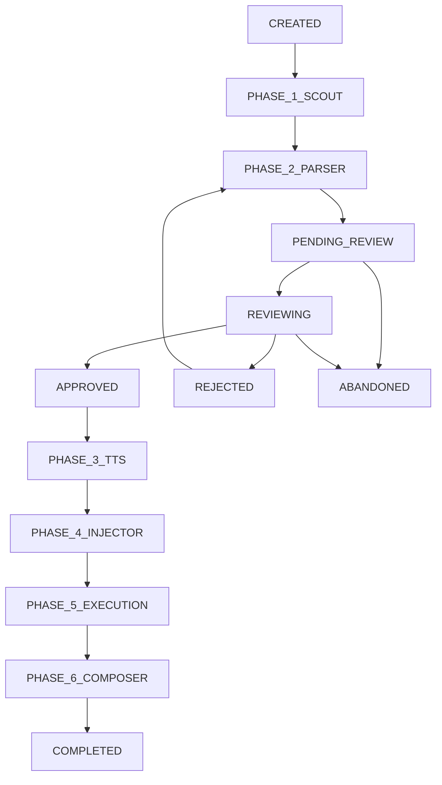

# Phase 2.5 Architecture: Job State Management & Human-in-the-Loop

## 🎯 Bài toán cốt lõi: Từ Tool cá nhân → SaaS thực thụ

### Vấn đề hiện tại

```
❌ Synchronous Model (Tool cá nhân):
Request → Worker chạy 6 phases → Response (10-15 phút)
- HTTP connection timeout
- Không scale được multi-user
- Không có cơ chế review/approve
```

### Giải pháp: Asynchronous Job State Management

```
✅ Asynchronous Model (SaaS):
Request → Job ID → Background Processing → State Updates → Human Review → Continue
- Instant response với Job ID
- Multi-user, multi-job support
- Human-in-the-loop tại Phase 2.5
- Real-time progress tracking
```

## 🏗️ Kiến trúc Job State Management

### 1. Redis Schema Design

#### 1.1 Job Metadata

```redis
# Job chính
job:88cc03eb-4f2a-4b5c-9d8e-1234567890ab
{
  "id": "88cc03eb-4f2a-4b5c-9d8e-1234567890ab",
  "user_id": "guest_123",
  "job_type": "web",
  "status": "pending_review",
  "phase": "2.5",
  "created_at": "2024-01-15T10:30:00Z",
  "updated_at": "2024-01-15T10:35:00Z",
  "task": "Hướng dẫn đăng ký GitHub",
  "config": {
    "voice": "banmai",
    "engine": "edge",
    "padding": 300
  },
  "progress": 40,
  "estimated_completion": "2024-01-15T10:45:00Z"
}
```

#### 1.2 Phase-specific Data

```redis
# Script content cho Phase 2.5 review
job:88cc03eb:script
{
  "segments": [
    {
      "id": "seg_001",
      "text": "Chào mừng các bạn đến với bài hướng dẫn sử dụng GitHub hôm nay.",
      "timing": 3.2,
      "action_type": "navigation",
      "screenshot_path": "/tmp/screenshots/001.png",
      "edited": false,
      "approved": false
    },
    {
      "id": "seg_002",
      "text": "Trước hết, chúng ta hãy cùng nhìn vào thanh điều hướng phía trên cùng.",
      "timing": 2.8,
      "action_type": "click",
      "screenshot_path": "/tmp/screenshots/002.png",
      "edited": true,
      "approved": false
    }
  ],
  "total_segments": 12,
  "reviewed_segments": 2,
  "approved_segments": 0,
  "review_status": "in_progress"
}

# Execution logs
job:88cc03eb:logs
[
  {"timestamp": "10:30:15", "phase": "1", "message": "Scout phase started"},
  {"timestamp": "10:32:20", "phase": "1", "message": "Generated 12 action steps"},
  {"timestamp": "10:33:45", "phase": "2", "message": "Parser phase completed"},
  {"timestamp": "10:34:00", "phase": "2.5", "message": "Waiting for human review"}
]

# Output files
job:88cc03eb:files
{
  "webreel_config": "/tmp/jobs/88cc03eb/config.json",
  "screenshots": "/tmp/jobs/88cc03eb/screenshots/",
  "audio_files": "/tmp/jobs/88cc03eb/audio/",
  "final_video": "/tmp/jobs/88cc03eb/output.mp4"
}
```

### 2. Job Lifecycle States



### 3. REST API Design

#### 3.1 Core Job Management APIs

```python
# main.py - Enhanced với Job State Management

from fastapi import FastAPI, HTTPException, BackgroundTasks
import uuid
import redis
import json
from datetime import datetime, timedelta

app = FastAPI()
redis_client = redis.Redis(host='localhost', port=6379, db=0)

class JobManager:
    def __init__(self):
        self.redis = redis_client

    def create_job(self, job_data: dict) -> str:
        """Tạo job mới và trả về job_id ngay lập tức"""
        job_id = str(uuid.uuid4())

        # Tạo job metadata
        job_metadata = {
            "id": job_id,
            "user_id": job_data.get("user_id", "guest"),
            "job_type": self.detect_job_type(job_data),
            "status": "created",
            "phase": "0",
            "created_at": datetime.utcnow().isoformat(),
            "updated_at": datetime.utcnow().isoformat(),
            "task": job_data.get("task", ""),
            "config": job_data.get("config", {}),
            "progress": 0,
            "estimated_completion": None
        }

        # Lưu vào Redis
        self.redis.hset(f"job:{job_id}", mapping=job_metadata)

        # Đẩy vào queue để worker xử lý
        queue_name = self.get_queue_for_type(job_metadata["job_type"])
        self.redis.lpush(queue_name, json.dumps({
            "job_id": job_id,
            "job_data": job_data
        }))

        return job_id

    def get_job_status(self, job_id: str) -> dict:
        """Lấy trạng thái hiện tại của job"""
        job_data = self.redis.hgetall(f"job:{job_id}")
        if not job_data:
            raise HTTPException(status_code=404, detail="Job not found")

        # Convert bytes to string
        return {k.decode(): v.decode() for k, v in job_data.items()}

    def get_job_script(self, job_id: str) -> dict:
        """Lấy script content cho Phase 2.5 review"""
        script_data = self.redis.get(f"job:{job_id}:script")
        if not script_data:
            raise HTTPException(status_code=404, detail="Script not ready")

        return json.loads(script_data)

    def approve_job_script(self, job_id: str, approved_script: dict):
        """Approve script và tiếp tục Phase 3"""
        # Lưu script đã approve
        self.redis.set(f"job:{job_id}:script", json.dumps(approved_script))

        # Cập nhật job status
        self.update_job_status(job_id, "approved", "3")

        # Đẩy vào TTS queue
        job_data = self.get_job_status(job_id)
        self.redis.lpush("tts-queue", json.dumps({
            "job_id": job_id,
            "script": approved_script,
            "config": json.loads(job_data["config"])
        }))

    def update_job_status(self, job_id: str, status: str, phase: str = None):
        """Cập nhật trạng thái job"""
        updates = {
            "status": status,
            "updated_at": datetime.utcnow().isoformat()
        }
        if phase:
            updates["phase"] = phase
            updates["progress"] = self.calculate_progress(phase)

        self.redis.hmset(f"job:{job_id}", updates)

    def calculate_progress(self, phase: str) -> int:
        """Tính % progress dựa trên phase"""
        phase_progress = {
            "0": 0, "1": 15, "2": 30, "2.5": 40,
            "3": 55, "4": 70, "5": 85, "6": 100
        }
        return phase_progress.get(phase, 0)

# API Endpoints
job_manager = JobManager()

@app.post("/api/jobs")
async def create_job(job_request: dict, background_tasks: BackgroundTasks):
    """Tạo job mới - trả về job_id ngay lập tức"""
    try:
        job_id = job_manager.create_job(job_request)
        return {
            "success": True,
            "job_id": job_id,
            "message": "Job created successfully",
            "estimated_time": "10-15 minutes"
        }
    except Exception as e:
        raise HTTPException(status_code=500, detail=str(e))

@app.get("/api/jobs/{job_id}/status")
async def get_job_status(job_id: str):
    """Lấy trạng thái job - Frontend polling endpoint"""
    try:
        status = job_manager.get_job_status(job_id)
        return {
            "success": True,
            "job": status
        }
    except HTTPException:
        raise
    except Exception as e:
        raise HTTPException(status_code=500, detail=str(e))

@app.get("/api/jobs/{job_id}/script")
async def get_job_script(job_id: str):
    """Lấy script content cho Phase 2.5 review"""
    try:
        script = job_manager.get_job_script(job_id)
        return {
            "success": True,
            "script": script
        }
    except HTTPException:
        raise
    except Exception as e:
        raise HTTPException(status_code=500, detail=str(e))

@app.post("/api/jobs/{job_id}/approve")
async def approve_job_script(job_id: str, approval_request: dict):
    """Approve script và tiếp tục Phase 3"""
    try:
        approved_script = approval_request.get("script")
        if not approved_script:
            raise HTTPException(status_code=400, detail="Script content required")

        job_manager.approve_job_script(job_id, approved_script)
        return {
            "success": True,
            "message": "Script approved, continuing to TTS phase"
        }
    except HTTPException:
        raise
    except Exception as e:
        raise HTTPException(status_code=500, detail=str(e))

@app.get("/api/jobs/{job_id}/logs")
async def get_job_logs(job_id: str):
    """Lấy execution logs cho debugging"""
    try:
        logs = redis_client.lrange(f"job:{job_id}:logs", 0, -1)
        return {
            "success": True,
            "logs": [json.loads(log) for log in logs]
        }
    except Exception as e:
        raise HTTPException(status_code=500, detail=str(e))
```

#### 3.2 Worker Integration với Job State

```python
# worker/base_worker.py - Enhanced với Job State Updates

class BaseWorker:
    def __init__(self):
        self.redis = redis.Redis(host='localhost', port=6379, db=0)
        self.job_manager = JobManager()

    def process_job(self, job_data: dict):
        """Base job processing với state management"""
        job_id = job_data["job_id"]

        try:
            # Phase 1: Scout
            self.update_job_phase(job_id, "1", "phase_1_scout")
            scout_result = self.run_scout_phase(job_data)

            # Phase 2: Parser
            self.update_job_phase(job_id, "2", "phase_2_parser")
            parser_result = self.run_parser_phase(scout_result)

            # Phase 2.5: STOP và chờ human review
            self.prepare_for_review(job_id, parser_result)

            # Worker dừng lại ở đây, chờ approval

        except Exception as e:
            self.handle_job_error(job_id, str(e))

    def prepare_for_review(self, job_id: str, parser_result: dict):
        """Chuẩn bị data cho Phase 2.5 review"""
        # Lưu script content
        script_data = {
            "segments": parser_result["narrations"],
            "total_segments": len(parser_result["narrations"]),
            "reviewed_segments": 0,
            "approved_segments": 0,
            "review_status": "pending"
        }

        self.redis.set(f"job:{job_id}:script", json.dumps(script_data))

        # Cập nhật job status
        self.job_manager.update_job_status(job_id, "pending_review", "2.5")

        # Log
        self.add_job_log(job_id, "2.5", "Script ready for human review")

    def update_job_phase(self, job_id: str, phase: str, status: str):
        """Cập nhật phase và status"""
        self.job_manager.update_job_status(job_id, status, phase)
        self.add_job_log(job_id, phase, f"Started {status}")

    def add_job_log(self, job_id: str, phase: str, message: str):
        """Thêm log entry"""
        log_entry = {
            "timestamp": datetime.utcnow().isoformat(),
            "phase": phase,
            "message": message
        }
        self.redis.lpush(f"job:{job_id}:logs", json.dumps(log_entry))
```

## 🎨 Frontend Implementation Strategy

### 1. Polling vs WebSocket Decision Matrix

| Aspect              | Polling (3s interval) | WebSocket Real-time  |
| ------------------- | --------------------- | -------------------- |
| **Complexity**      | ⭐⭐ Simple           | ⭐⭐⭐⭐ Complex     |
| **Resource Usage**  | ⭐⭐⭐ Moderate       | ⭐⭐⭐⭐⭐ Efficient |
| **Reliability**     | ⭐⭐⭐⭐⭐ High       | ⭐⭐⭐ Medium        |
| **MVP Speed**       | ⭐⭐⭐⭐⭐ Fast       | ⭐⭐ Slow            |
| **User Experience** | ⭐⭐⭐ Good           | ⭐⭐⭐⭐⭐ Excellent |

**Recommendation**: Start với Polling cho MVP, upgrade to WebSocket sau.

### 2. Frontend Job Management

```javascript
// JobManager.js - Frontend job state management
class JobManager {
  constructor() {
    this.activeJobs = new Map();
    this.pollingIntervals = new Map();
    this.loadJobsFromStorage();
  }

  async createJob(jobData) {
    try {
      const response = await fetch("/api/jobs", {
        method: "POST",
        headers: { "Content-Type": "application/json" },
        body: JSON.stringify(jobData),
      });

      const result = await response.json();
      if (result.success) {
        // Lưu job_id vào localStorage
        this.addJobToStorage(result.job_id);

        // Bắt đầu polling
        this.startPolling(result.job_id);

        return result.job_id;
      }
    } catch (error) {
      console.error("Failed to create job:", error);
      throw error;
    }
  }

  startPolling(jobId) {
    // Polling mỗi 3 giây
    const interval = setInterval(async () => {
      try {
        const status = await this.getJobStatus(jobId);
        this.updateJobState(jobId, status);

        // Dừng polling nếu job completed hoặc failed
        if (["completed", "failed", "abandoned"].includes(status.status)) {
          this.stopPolling(jobId);
        }

        // Trigger UI update
        this.notifyJobUpdate(jobId, status);
      } catch (error) {
        console.error(`Polling error for job ${jobId}:`, error);
      }
    }, 3000);

    this.pollingIntervals.set(jobId, interval);
  }

  async getJobStatus(jobId) {
    const response = await fetch(`/api/jobs/${jobId}/status`);
    const result = await response.json();
    return result.job;
  }

  async getJobScript(jobId) {
    const response = await fetch(`/api/jobs/${jobId}/script`);
    const result = await response.json();
    return result.script;
  }

  async approveScript(jobId, approvedScript) {
    const response = await fetch(`/api/jobs/${jobId}/approve`, {
      method: "POST",
      headers: { "Content-Type": "application/json" },
      body: JSON.stringify({ script: approvedScript }),
    });

    return response.json();
  }

  // LocalStorage management
  addJobToStorage(jobId) {
    const jobs = this.getJobsFromStorage();
    jobs.push(jobId);
    localStorage.setItem("webreel_jobs", JSON.stringify(jobs));
  }

  getJobsFromStorage() {
    const jobs = localStorage.getItem("webreel_jobs");
    return jobs ? JSON.parse(jobs) : [];
  }

  loadJobsFromStorage() {
    const jobs = this.getJobsFromStorage();
    jobs.forEach((jobId) => {
      this.startPolling(jobId);
    });
  }
}
```

### 3. Phase 2.5 Review Component

```jsx
// Phase25Review.jsx - React component cho script review
import React, { useState, useEffect } from "react";

const Phase25Review = ({ jobId, onApprove, onReject }) => {
  const [script, setScript] = useState(null);
  const [editedSegments, setEditedSegments] = useState({});
  const [loading, setLoading] = useState(true);

  useEffect(() => {
    loadScript();
  }, [jobId]);

  const loadScript = async () => {
    try {
      const jobManager = new JobManager();
      const scriptData = await jobManager.getJobScript(jobId);
      setScript(scriptData);
      setLoading(false);
    } catch (error) {
      console.error("Failed to load script:", error);
    }
  };

  const handleSegmentEdit = (segmentId, newText) => {
    setEditedSegments((prev) => ({
      ...prev,
      [segmentId]: newText,
    }));
  };

  const handleApprove = async () => {
    try {
      // Merge edited segments back to script
      const approvedScript = {
        ...script,
        segments: script.segments.map((segment) => ({
          ...segment,
          text: editedSegments[segment.id] || segment.text,
          edited: !!editedSegments[segment.id],
          approved: true,
        })),
      };

      const jobManager = new JobManager();
      await jobManager.approveScript(jobId, approvedScript);
      onApprove();
    } catch (error) {
      console.error("Failed to approve script:", error);
    }
  };

  if (loading) {
    return <div className="loading">Loading script for review...</div>;
  }

  return (
    <div className="phase25-review">
      <div className="review-header">
        <h2>📝 TTS Script Review - Job {jobId.substring(0, 8)}</h2>
        <div className="review-stats">
          <span>Total segments: {script.total_segments}</span>
          <span>Edited: {Object.keys(editedSegments).length}</span>
        </div>
      </div>

      <div className="segments-container">
        {script.segments.map((segment, index) => (
          <SegmentEditor
            key={segment.id}
            segment={segment}
            index={index}
            onEdit={(newText) => handleSegmentEdit(segment.id, newText)}
            editedText={editedSegments[segment.id]}
          />
        ))}
      </div>

      <div className="review-actions">
        <button
          className="btn-approve"
          onClick={handleApprove}
          disabled={script.segments.length === 0}
        >
          ✅ Approve & Continue to TTS
        </button>
        <button className="btn-reject" onClick={onReject}>
          ❌ Reject & Back to Parser
        </button>
      </div>
    </div>
  );
};

const SegmentEditor = ({ segment, index, onEdit, editedText }) => {
  const [isEditing, setIsEditing] = useState(false);
  const [text, setText] = useState(editedText || segment.text);

  const handleSave = () => {
    onEdit(text);
    setIsEditing(false);
  };

  return (
    <div className="segment-editor">
      <div className="segment-header">
        <span className="segment-number">Segment {index + 1}</span>
        <span className="segment-timing">{segment.timing}s</span>
        <button className="btn-play">🔊 Preview</button>
      </div>

      {isEditing ? (
        <div className="segment-edit-mode">
          <textarea
            value={text}
            onChange={(e) => setText(e.target.value)}
            className="segment-textarea"
            rows={3}
          />
          <div className="edit-actions">
            <button onClick={handleSave}>💾 Save</button>
            <button onClick={() => setIsEditing(false)}>❌ Cancel</button>
          </div>
        </div>
      ) : (
        <div className="segment-display-mode">
          <p className={`segment-text ${editedText ? "edited" : ""}`}>
            {editedText || segment.text}
          </p>
          <div className="segment-actions">
            <button onClick={() => setIsEditing(true)}>✏️ Edit</button>
            <button>🗑️ Delete</button>
            <button>➕ Add After</button>
          </div>
        </div>
      )}
    </div>
  );
};

export default Phase25Review;
```

## 🚀 Implementation Roadmap

### Phase 1: Core Job State Management (Week 1)

- [ ] Redis schema implementation
- [ ] Job lifecycle state machine
- [ ] Basic REST APIs (create, status, script, approve)
- [ ] Worker integration với state updates

### Phase 2: Frontend Job Management (Week 2)

- [ ] JobManager class với polling
- [ ] Job dashboard với progress tracking
- [ ] LocalStorage persistence
- [ ] Error handling & retry logic

### Phase 3: Phase 2.5 Review Interface (Week 3)

- [ ] Script review component
- [ ] Segment editing functionality
- [ ] Audio preview integration
- [ ] Approval/rejection workflow

### Phase 4: Production Optimizations (Week 4)

- [ ] WebSocket upgrade (optional)
- [ ] Job cleanup & archival
- [ ] Performance monitoring
- [ ] Multi-user session management

## 🎯 Success Metrics

### Technical Metrics

- **Job Creation Time**: < 500ms response
- **State Update Latency**: < 1s from worker to frontend
- **Review Session Duration**: Average 2-3 minutes
- **System Throughput**: 50+ concurrent jobs

### User Experience Metrics

- **Review Completion Rate**: > 90%
- **Script Edit Rate**: 60-80% (indicates AI needs improvement)
- **User Satisfaction**: Phase 2.5 prevents 95% of bad outputs

---

**Kết luận**: Kiến trúc này chuyển đổi hoàn toàn từ "blocking tool" sang "responsive SaaS platform". Phase 2.5 Human-in-the-loop là điểm khác biệt cạnh tranh, đảm bảo chất lượng output và tối ưu hóa chi phí tài nguyên.
