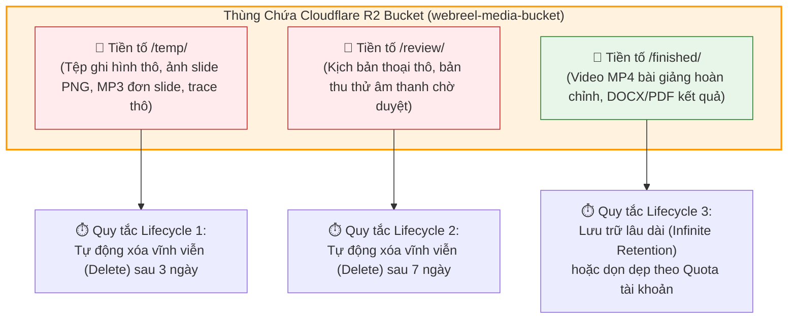

# TÀI LIỆU THIẾT KẾ CƠ SỞ DỮ LIỆU VÀ HẠ TẦNG LƯU TRỮ HỆ THỐNG WEBREEL (DATA & STORAGE DESIGN)

Tài liệu này trình bày chi tiết về thiết kế dữ liệu và hạ tầng lưu trữ của hệ thống WebReel. Nội dung bao gồm việc xây dựng lược đồ dữ liệu (MongoDB BSON Schema) cho Collection `users` (phân quyền RBAC, Quota hạn mức) và Collection `jobs` (trạng thái vòng đời tác vụ động), Chiến lược thiết lập chỉ mục (Indexing Strategy) để tối ưu hóa tốc độ truy xuất của Dashboard trong môi trường bất đồng bộ, và Kiến trúc lưu trữ đối tượng đám mây Cloudflare R2 (Quy hoạch CDN phụ, Quy tắc vòng đời Lifecycle để thanh lọc dữ liệu). Tài liệu hoàn toàn bằng tiếng Việt và không chứa mã nguồn.

---

## 1. THIẾT KẾ LƯỢC ĐỒ DỮ LIỆU TÀI LIỆU (MONGODB SCHEMA)

Hệ thống WebReel sử dụng cơ sở dữ liệu phi quan hệ MongoDB để lưu trữ dữ liệu dạng tài liệu BSON mềm dẻo. Thiết kế này đặc biệt phù hợp với các Job có cấu hình biến động lớn giữa các Worker khác nhau (ví dụ: Job của Web Worker lưu cấu hình trình duyệt, Job của OS Worker lưu cấu hình phần mềm Windows Desktop).

### 1.1. Collection `users` (Quản lý Phân quyền và Hạn mức)

Collection này lưu trữ thông tin tài khoản, mật khẩu băm, vai trò quản trị (RBAC) và hạn mức tài nguyên (Quota) được cấp phát cho từng người dùng để kiểm soát dung lượng máy chủ VPS.

#### Cấu trúc tài liệu BSON mẫu (Dạng cấu trúc dữ liệu)

```json
{
  "_id": "ObjectId",
  "user_id": "UUID",
  "name": "String",
  "email": "String",
  "password_hash": "String",
  "role": "String",
  "tier": "String",
  "status": "String",
  "email_verified": "Boolean",
  "verification_token": "String",
  "quota": {
    "videos_per_month": "Integer",
    "videos_used_this_month": "Integer",
    "reset_date": "ISODate"
  },
  "created_at": "ISODate",
  "last_login": "ISODate"
}
```

#### Mô tả chi tiết các trường thông tin trong Collection `users`

| Tên Trường                     | Kiểu Dữ Liệu | Ràng Buộc        | Mô Tả Nghiệp Vụ                                                                                                           |
| :----------------------------- | :----------- | :--------------- | :------------------------------------------------------------------------------------------------------------------------ |
| `_id`                          | ObjectId     | Khóa chính       | Mã định danh duy nhất tự động sinh bởi MongoDB cho mỗi bản ghi.                                                           |
| `user_id`                      | UUID         | Bắt buộc         | Mã định danh UUID duy nhất của người dùng trên toàn hệ thống (được tự động sinh bằng `uuid4`).                            |
| `name`                         | String       | Bắt buộc         | Tên đầy đủ hoặc tên hiển thị của người dùng (từ 1 đến 100 ký tự).                                                         |
| `email`                        | String       | Unique, Bắt buộc | Địa chỉ email duy nhất dùng để đăng nhập hệ thống và gửi thông báo.                                                       |
| `password_hash`                | String       | Bắt buộc         | Mật khẩu băm an toàn bằng thuật toán bcrypt.                                                                              |
| `role`                         | String       | Bắt buộc         | Quyền hạn truy cập hệ thống (RBAC): `user` (người dùng thông thường), `admin` (quản trị viên hệ thống).                   |
| `tier`                         | String       | Bắt buộc         | Gói đăng ký dịch vụ: `free` (miễn phí), `pro` (nâng cao), `enterprise` (doanh nghiệp).                                    |
| `status`                       | String       | Bắt buộc         | Trạng thái tài khoản: `pending_verification` (chờ xác minh email), `active` (đang hoạt động), `suspended` (đang bị khóa). |
| `email_verified`               | Boolean      | Bắt buộc         | Đánh dấu địa chỉ email đã được xác minh kích hoạt hay chưa (mặc định: `false`).                                           |
| `verification_token`           | String       | Tùy chọn         | Token chuỗi dùng để gửi link xác minh kích hoạt tài khoản qua email.                                                      |
| `quota.videos_per_month`       | Integer      | Bắt buộc         | Số lượng video bài giảng tối đa được phép sản xuất trong tháng (mặc định: 100 video).                                     |
| `quota.videos_used_this_month` | Integer      | Bắt buộc         | Số lượng video thực tế đã sản xuất trong tháng hiện tại.                                                                  |
| `quota.reset_date`             | ISODate      | Bắt buộc         | Thời điểm hệ thống tự động thiết lập lại chỉ số `videos_used_this_month` về 0 (chu kỳ hàng tháng).                        |
| `created_at`                   | ISODate      | Tự động          | Thời điểm tài khoản được đăng ký trên hệ thống.                                                                           |
| `last_login`                   | ISODate      | Tùy chọn         | Thời điểm đăng nhập gần đây nhất của người dùng.                                                                          |

---

### 1.2. Collection `jobs` (Quản lý Vòng đời Tác vụ Động)

Collection này lưu trữ thông tin chi tiết về từng yêu cầu làm video bài giảng. Do có nhiều loại Worker với cấu hình đầu vào/đầu ra khác nhau, cấu hình cấu trúc Job được thiết kế linh hoạt bằng các đối tượng nhúng (embedded objects) giúp quản lý vòng đời chuyển trạng thái động của Job từ lúc xếp hàng đợi cho đến lúc lưu trữ thành phẩm.

#### Cấu trúc tài liệu BSON mẫu (Dạng cấu trúc dữ liệu)

```json
{
  "_id": "ObjectId",
  "job_id": "UUID",
  "status": "String",
  "task": "String",
  "video_name": "String",
  "environment": "String",
  "config": {
    "enable_tts": "Boolean",
    "tts_voice": "String",
    "tts_engine": "String",
    "cdp_url": "String",
    "padding_ms": "Integer",
    "enable_review": "Boolean",
    "target_pid": "Integer",
    "app_executable": "String",
    "app_type": "String",
    "uploaded_file_url": "String",
    "browser_url": "String",
    "max_steps": "Integer",
    "enable_dual_output": "Boolean"
  },
  "progress": {
    "current_phase": "Integer",
    "phase_name": "String",
    "message": "String",
    "logs": "Array"
  },
  "result": {
    "video_path": "String",
    "video_url": "String",
    "document_path": "String",
    "document_url": "String",
    "pdf_path": "String",
    "pdf_url": "String",
    "duration_seconds": "Double",
    "file_sizes": "Object",
    "metadata": "Object"
  },
  "error": "String",
  "created_at": "ISODate",
  "started_at": "ISODate",
  "completed_at": "ISODate"
}
```

#### Mô tả chi tiết các trường thông tin trong Collection `jobs`

| Tên Trường                  | Kiểu Dữ Liệu | Ràng Buộc       | Mô Tả Nghiệp Vụ                                                                                                                                                                                                                                                                 |
| :-------------------------- | :----------- | :-------------- | :------------------------------------------------------------------------------------------------------------------------------------------------------------------------------------------------------------------------------------------------------------------------------ |
| `_id`                       | ObjectId     | Khóa chính      | Mã duy nhất tự động sinh bởi MongoDB cho mỗi bản ghi Job.                                                                                                                                                                                                                       |
| `job_id`                    | UUID         | Unique, Indexed | Mã định danh UUID duy nhất của công việc (được tự động sinh bằng `uuid4`), dùng để truy vấn và kiểm tra tiến độ từ Frontend.                                                                                                                                                    |
| `status`                    | String       | Bắt buộc        | **Quản lý vòng đời tác vụ:** `pending` (chờ nhận), `running` (đang khởi động), `processing` (đang chạy), `queued` (đã xếp vào hàng đợi Redis), `pending_review` (chờ duyệt kịch bản thoại), `completed` (hoàn thành), `failed` (thất bại), `interrupted` (bị gián đoạn/hủy bỏ). |
| `task`                      | String       | Bắt buộc        | Nội dung mô tả tác vụ AI cần thực hiện hoặc kịch bản chữ do người dùng cung cấp.                                                                                                                                                                                                |
| `video_name`                | String       | Bắt buộc        | Tên của tệp video đầu ra (chỉ chứa chữ cái, chữ số, gạch dưới, gạch ngang).                                                                                                                                                                                                     |
| `environment`               | String       | Bắt buộc        | Môi trường thực thi: `web` (trình duyệt web), `os` (hệ điều hành Windows), `presentation` (OneDrive/Google Slides).                                                                                                                                                             |
| `config.enable_tts`         | Boolean      | Bắt buộc        | Bật/tắt thuyết minh giọng nói AI (mặc định: `true`).                                                                                                                                                                                                                            |
| `config.tts_voice`          | String       | Bắt buộc        | Mã giọng đọc AI thuyết minh (ví dụ: `banmai`, `minhquang`).                                                                                                                                                                                                                     |
| `config.tts_engine`         | String       | Bắt buộc        | Bộ phát giọng nói AI: `fpt` (FPT.AI API), `edge` (Edge TTS).                                                                                                                                                                                                                    |
| `config.cdp_url`            | String       | Bắt buộc        | URL cổng điều phối trình duyệt ảo từ xa (mặc định: `http://localhost:9222`).                                                                                                                                                                                                    |
| `config.padding_ms`         | Integer      | Bắt buộc        | Khoảng đệm thời gian âm thanh ở đầu và cuối slide/thao tác (mặc định: `300` mili-giây).                                                                                                                                                                                         |
| `config.enable_review`      | Boolean      | Bắt buộc        | Bật/tắt điểm dừng phê duyệt kịch bản thoại ở Pha 2.5 (mặc định: `false`).                                                                                                                                                                                                       |
| `config.target_pid`         | Integer      | Tùy chọn        | Dành cho Windows OS Worker V3: Mã tiến trình phần mềm Windows đang mở cần tự động hóa.                                                                                                                                                                                          |
| `config.app_executable`     | String       | Tùy chọn        | Dành cho Windows OS Worker V3: Đường dẫn chạy tệp phần mềm Windows đích.                                                                                                                                                                                                        |
| `config.app_type`           | String       | Tùy chọn        | Dành cho Windows OS Worker V4: Tên ứng dụng Windows cần mở (`excel`, `word`, `powerpoint`, `chrome`, `edge`, `firefox`, `notepad`, `calculator`, `paint`).                                                                                                                      |
| `config.uploaded_file_url`  | String       | Tùy chọn        | Dành cho Office/OS: Đường dẫn URL tệp tài liệu do người dùng tải lên.                                                                                                                                                                                                           |
| `config.browser_url`        | String       | Tùy chọn        | URL trang web cần tự động mở (cho các ứng dụng chạy trình duyệt).                                                                                                                                                                                                               |
| `config.max_steps`          | Integer      | Bắt buộc        | Số bước thao tác tối đa mà AI được phép thực hiện (mặc định: `15` bước).                                                                                                                                                                                                        |
| `config.enable_dual_output` | Boolean      | Bắt buộc        | Cho phép kết xuất cả video và tài liệu sản phẩm PDF/Word (mặc định: `true`).                                                                                                                                                                                                    |
| `progress.current_phase`    | Integer      | Tùy chọn        | Chỉ số pha hiện tại của Worker đang chạy (từ `0` đến `6`).                                                                                                                                                                                                                      |
| `progress.phase_name`       | String       | Tùy chọn        | Tên hiển thị bằng tiếng Việt của pha hiện tại để cập nhật giao diện người dùng.                                                                                                                                                                                                 |
| `progress.message`          | String       | Tùy chọn        | Thông điệp thông báo trạng thái chi tiết của bước thực thi hiện tại.                                                                                                                                                                                                            |
| `progress.logs`             | Array        | Tùy chọn        | Mảng lưu danh sách các bản ghi nhật ký (logs) chi tiết của tiến trình xử lý.                                                                                                                                                                                                    |
| `result.video_path`         | String       | Tùy chọn        | Đường dẫn tệp tin video thô lưu trữ tạm thời trên ổ đĩa máy chủ.                                                                                                                                                                                                                |
| `result.video_url`          | String       | Tùy chọn        | Đường dẫn xem/tải video MP4 hoàn thành được phân phối qua Cloudflare R2 CDN.                                                                                                                                                                                                    |
| `result.document_path`      | String       | Tùy chọn        | Đường dẫn tệp Word (.docx) kết quả tạm thời trên ổ đĩa máy chủ.                                                                                                                                                                                                                 |
| `result.document_url`       | String       | Tùy chọn        | Đường dẫn tải tệp Word (.docx) thành phẩm được phân phối qua Cloudflare R2 CDN.                                                                                                                                                                                                 |
| `result.pdf_path`           | String       | Tùy chọn        | Đường dẫn tệp PDF kết quả tạm thời trên ổ đĩa máy chủ.                                                                                                                                                                                                                          |
| `result.pdf_url`            | String       | Tùy chọn        | Đường dẫn tải tệp PDF thành phẩm được phân phối qua Cloudflare R2 CDN.                                                                                                                                                                                                          |
| `result.duration_seconds`   | Double       | Tùy chọn        | Thời lượng phát chính xác của video bài giảng hoàn thành (giây).                                                                                                                                                                                                                |
| `result.file_sizes`         | Object       | Tùy chọn        | Đối tượng lưu kích thước của các tệp tin kết quả (`video`, `document`, `pdf`).                                                                                                                                                                                                  |
| `result.metadata`           | Object       | Tùy chọn        | Siêu dữ liệu phụ trợ của tệp tin đầu ra.                                                                                                                                                                                                                                        |
| `error`                     | String       | Tùy chọn        | Thông tin chi tiết lỗi nếu trạng thái Job là `failed`.                                                                                                                                                                                                                          |
| `created_at`                | ISODate      | Tự động         | Thời điểm người dùng tạo Job trên hệ thống.                                                                                                                                                                                                                                     |
| `started_at`                | ISODate      | Tùy chọn        | Thời điểm Worker nhận Job và bắt đầu Pha 1.                                                                                                                                                                                                                                     |
| `completed_at`              | ISODate      | Tùy chọn        | Thời điểm Worker kết xuất thành công và lưu kết quả.                                                                                                                                                                                                                            |

---

## 2. CHIẾN LƯỢC THIẾT LẬP CHỈ MỤC (INDEXING STRATEGY)

Trong môi trường xử lý bất đồng bộ, người dùng liên tục truy cập và làm mới trang Dashboard cá nhân để theo dõi danh sách các Job của họ, lọc theo trạng thái (ví dụ: tìm các Job đang chờ duyệt "pending_review"), lọc theo loại tác vụ (ví dụ: tìm các video Google Slides), hoặc xem các Job mới tạo gần đây nhất.

Nếu cơ sở dữ liệu MongoDB chứa hàng chục ngàn Job mà không được thiết lập chỉ mục hợp lý, MongoDB buộc phải quét toàn bộ bảng dữ liệu (Collection Scan - COLLSCAN) để trả về kết quả, gây nghẽn kết nối và làm chậm hệ thống API. Để tối ưu hóa tốc độ truy xuất, WebReel thiết kế chiến lược chỉ mục phức hợp (Compound Indexes) dựa trên nguyên tắc **ESR (Equality, Sort, Range)**:

### 2.1. Thiết kế các chỉ mục trên Collection `jobs`

1.  **Chỉ mục Đơn trên mã Job (Single Field Index):**
    - _Cấu trúc:_ `{ job_id: 1 }`
    - _Mục đích:_ Tối ưu hóa tốc độ truy vấn chi tiết một Job cụ thể khi người dùng xem trang trạng thái hoặc khi API Gateway nhận phản hồi tiến độ từ Worker.
    - _Loại:_ Độc nhất (Unique Index).
2.  **Chỉ mục Phức hợp 1 - Tối ưu hóa Danh sách Dashboard (User Dashboard Index):**
    - _Cấu trúc:_ `{ user_id: 1, created_at: -1 }`
    - _Mục đích:_ Khi người dùng mở Dashboard, hệ thống luôn truy vấn danh sách mọi Job thuộc sở hữu của người dùng đó (`user_id` là so sánh bằng - Equality) và sắp xếp theo thứ tự mới nhất đứng đầu (`created_at` là sắp xếp - Sort). Chỉ mục này giúp MongoDB trả về kết quả ngay lập tức nhờ cơ chế quét chỉ mục (Index Scan - IXSCAN) mà không cần thực hiện sắp xếp dữ liệu trong RAM.
3.  **Chỉ mục Phức hợp 2 - Tối ưu hóa Bộ lọc Trạng thái và Loại (Status & Type Filter Index):**
    - _Cấu trúc:_ `{ user_id: 1, status: 1, type: 1, created_at: -1 }`
    - _Mục đích:_ Khi người dùng thực hiện lọc nâng cao trên Dashboard (ví dụ: "Tìm các Job thuộc chế độ Trình chiếu PowerPoint của tôi đã Hoàn thành"), MongoDB sẽ sử dụng chỉ mục này để lọc nhanh theo `user_id`, `status`, `type` và trả về kết quả được sắp xếp sẵn theo thời gian tạo.
4.  **Chỉ mục Phức hợp 3 - Dành cho Autoscaler và Quản lý Hàng Đợi (Queue Index):**
    - _Cấu trúc:_ `{ status: 1, created_at: 1 }`
    - _Mục đích:_ Giúp hệ thống Autoscaler và các tiến trình giám sát truy vấn nhanh các Job đang ở trạng thái xếp hàng đợi (`status: "queued"`) theo thứ tự thời gian tăng dần (`created_at: 1` - Job nào vào trước xử lý trước) để kiểm tra tình trạng nghẽn hoặc phân phối lại.

---

## 3. KIẾN TRÚC LƯU TRỮ ĐỐI TƯỢNG ĐÁM MÂY (CLOUDFLARE R2 STORAGE)

Hệ thống WebReel sử dụng dịch vụ lưu trữ đối tượng đám mây Cloudflare R2 để lưu trữ toàn bộ tài liệu tải lên và video bài giảng thành phẩm. Cloudflare R2 có ưu thế vượt trội là **miễn phí 100% băng thông tải xuống (Zero Egress Fees)**, giúp tiết kiệm chi phí vận hành khổng lồ khi người dùng tải hoặc xem video bài giảng nhiều lần.

### 3.1. Quy hoạch phân phối tĩnh qua tên miền phụ CDN (Custom Subdomain)

Thay vì sử dụng các đường dẫn truy cập mặc định phức tạp và kém bảo mật của Cloudflare R2, hệ thống thiết lập cấu hình phân phối tĩnh chuyên nghiệp:

- **Tên miền phụ CDN:** Ánh xạ một tên miền phụ (ví dụ: `media.webreel.ai` hoặc `cdn.webreel.ai`) trỏ về thùng chứa đối tượng (R2 Bucket) thông qua bản ghi DNS CNAME của Cloudflare, kích hoạt chứng chỉ bảo mật SSL/TLS tự động.
- **Bảo mật đường truyền (Presigned URLs):** Mặc dù tệp video hoàn thành được phân phối qua CDN, nhưng để tránh việc người lạ dò tìm hoặc tải trộm video của khách hàng, R2 Bucket được cấu hình ở chế độ **Riêng tư (Private)**. Khi người dùng hợp lệ yêu cầu xem/tải video, API Gateway sẽ tạo ra một đường dẫn liên kết ký sẵn (Presigned URL) có thời hạn hiệu lực ngắn (mặc định là 15 phút). Trình duyệt của người dùng sử dụng liên kết này để stream video trực tiếp từ CDN một cách an toàn.

---

### 3.2. Cấu hình quy tắc vòng đời đối tượng (Object Lifecycle Management)

Trong quá trình thực thi ghi hình và kết xuất, các Worker liên tục tạo ra hàng trăm Megabytes dữ liệu trung gian: ảnh chụp slide PNG tĩnh, các tệp âm thanh thuyết minh MP3 đơn lẻ của từng slide, video ghi màn hình ảo thô chưa có tiếng, và các tệp nhật ký vết trình duyệt. Nếu lưu trữ toàn bộ các tệp trung gian này vĩnh viễn, dung lượng R2 sẽ nhanh chóng bị đầy và làm tăng chi phí lưu trữ không đáng có.

WebReel thiết lập **Quy tắc vòng đời đối tượng (Lifecycle Rules)** tự động phân vùng lưu trữ dựa trên tiền tố đường dẫn (Prefix):



#### Mô tả chi tiết cấu hình các Quy tắc Vòng đời Đối tượng (XML Policy)

1.  **Quy tắc 1 - Tự động dọn dẹp phân vùng tạm thời `/temp/`:**
    - _Tiền tố áp dụng (Prefix):_ `temp/`
    - _Mô tả nghiệp vụ:_ Phân vùng này chứa các ảnh slide PNG tĩnh trích xuất từ PPTX, tệp giọng nói MP3 riêng lẻ của từng slide, video thô chưa ghép tiếng và tệp nhật ký trình duyệt thô. Các tệp này chỉ có giá trị sử dụng trong quá trình Worker biên tập video ở Pha 6.
    - _Hành động vòng đời:_ Tự động xóa vĩnh viễn toàn bộ đối tượng có tiền tố này sau **3 ngày** kể từ ngày khởi tạo, giúp máy chủ giải phóng dung lượng rác tự động.
2.  **Quy tắc 2 - Tự động dọn dẹp phân vùng kiểm duyệt `/review/`:**
    - _Tiền tố áp dụng (Prefix):_ `review/`
    - _Mô tả nghiệp vụ:_ Chứa thông tin các kịch bản thoại thô và các tệp âm thanh mẫu chờ người dùng phê duyệt (Pha 2.5).
    - _Hành động vòng đời:_ Nếu người dùng phê duyệt kịch bản, dữ liệu hoàn thành sẽ được đóng gói và lưu sang phân vùng finished. Các dữ liệu nháp nằm chờ duyệt quá lâu mà không có tương tác sẽ bị hệ thống tự động xóa bỏ sau **7 ngày** để tránh lãng phí dung lượng.
3.  **Quy tắc 3 - Lưu trữ bền vững phân vùng thành phẩm `/finished/`:**
    - _Tiền tố áp dụng (Prefix):_ `finished/`
    - _Mô tả nghiệp vụ:_ Chứa tệp video bài giảng MP4 hoàn chỉnh và các tài liệu kết xuất đầu ra (DOCX, PDF) thành phẩm. Đây là tài sản của người dùng.
    - _Hành động vòng đời:_ Không áp dụng quy tắc xóa tự động. Dữ liệu được lưu trữ lâu dài vĩnh viễn (Infinite Retention) và chỉ bị xóa khi người dùng thực hiện hành động xóa thủ công (UC-06) hoặc khi tài khoản của họ bị tạm khóa do vượt quá hạn mức lưu trữ Quota cho phép được định cấu hình trong Collection `users`.
