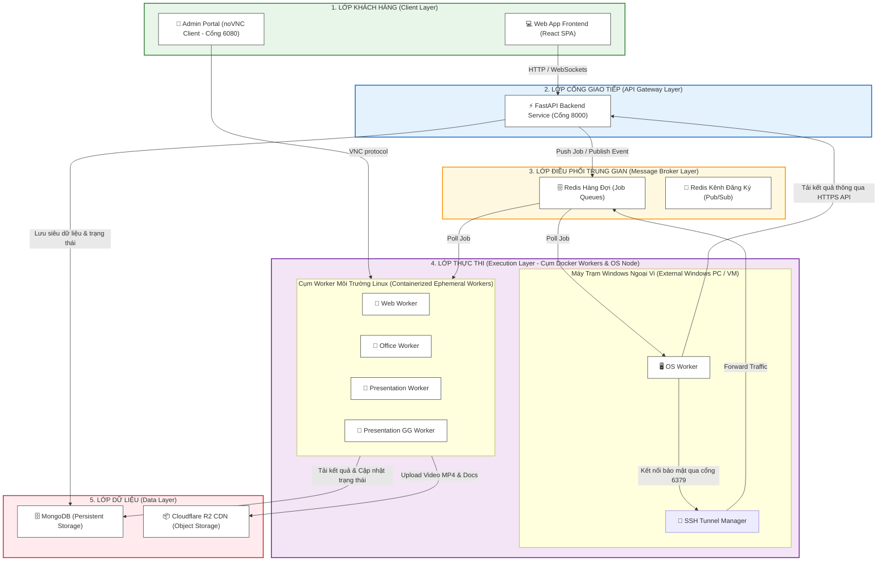
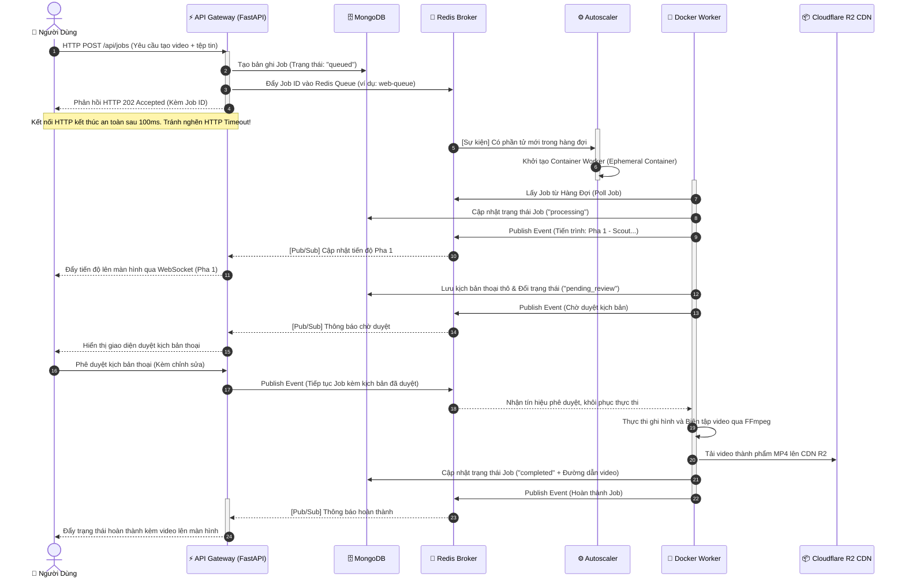
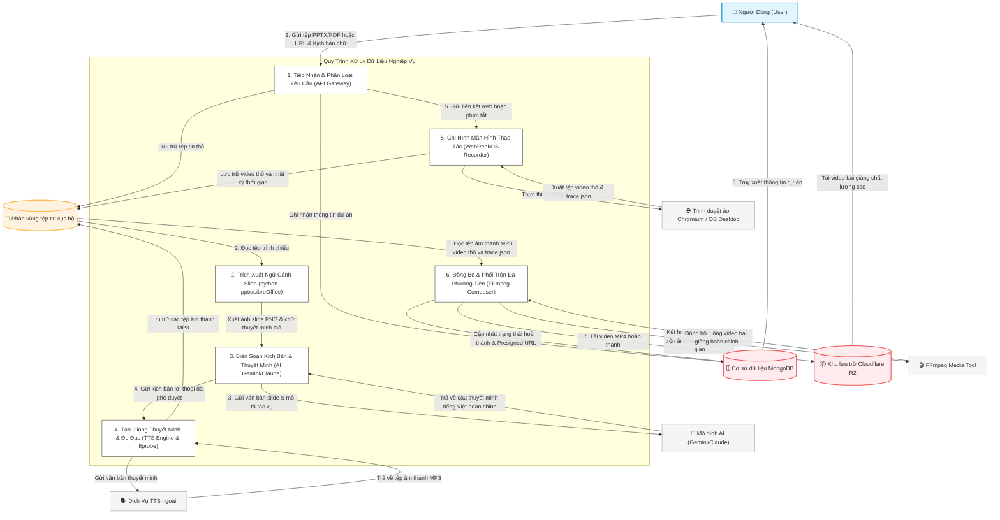

# TÀI LIỆU THIẾT KẾ KIẾN TRÚC TỔNG THỂ HỆ THỐNG WEBREEL (OVERALL ARCHITECTURE)

Tài liệu này trình bày chi tiết về thiết kế kiến trúc tổng thể của hệ thống WebReel. Nội dung bao gồm việc mô tả mô hình Kiến trúc vi dịch vụ phân tán 5 lớp (5-Layer Distributed Microservices), Cơ chế điều phối hướng sự kiện (Event-Driven Broker) sử dụng Redis Pub/Sub để loại bỏ hiện tượng nghẽn kết nối (HTTP Timeout) khi xử lý kết xuất video dài, và Sơ đồ luồng dữ liệu tổng quát (Data Flow Diagram - DFD) của hệ thống. Tài liệu hoàn toàn bằng tiếng Việt và không chứa mã nguồn.

---

## 1. KIẾN TRÚC VI DỊCH VỤ PHÂN TÁN (DISTRIBUTED MICROSERVICES)

Hệ thống WebReel được thiết kế theo mô hình kiến trúc phân lớp hướng dịch vụ, chia thành 5 phân lớp chức năng rõ ràng. Thiết kế này giúp hệ thống đạt hiệu năng cao, dễ dàng bảo trì độc lập và có khả năng co giãn tối ưu trong môi trường sản xuất (Docker Compose Prod).

### 1.1. Sơ đồ khối 5 phân lớp hệ thống

Dưới đây là sơ đồ khối mô tả kiến trúc phân lớp của hệ thống WebReel:

### 1.2. Mô tả vai trò nghiệp vụ của từng lớp

1.  **Lớp Khách Hàng (Client Layer):**
    - _Frontend (React SPA):_ Giao diện tương tác chính của người dùng, dùng để gửi yêu cầu dự án, theo dõi mốc tiến trình thời gian thực, duyệt kịch bản (Pha 2.5) và xem/tải kết quả.
    - _Admin Portal (noVNC):_ Cửa sổ quản trị đồ họa cho phép Admin can thiệp từ xa vào trình duyệt gốc nhằm thực hiện đăng nhập và giải quyết thử thách Captcha.
2.  **Lớp Cổng Giao Tiếp (API Gateway Layer):**
    - _FastAPI Backend:_ Điểm tiếp nhận duy nhất mọi yêu cầu từ khách hàng. Thực hiện xác thực người dùng, kiểm tra tính hợp lệ của tệp tin, ghi nhận thông tin Job vào cơ sở dữ liệu và đẩy tác vụ vào Redis Queue để xử lý bất đồng bộ.
3.  **Lớp Điều Phối Trung Gian (Message Broker Layer):**
    - _Redis Hàng Đợi (Job Queues):_ Lưu trữ tạm thời thông tin tác vụ theo cơ chế FIFO (First-In, First-Out). Chia tách riêng biệt thành các hàng đợi chuyên dụng cho từng loại Worker để tối ưu hóa điều phối.
    - _Redis Pub/Sub:_ Kênh truyền thông điệp hướng sự kiện giúp API Gateway nhận phản hồi về tiến độ xử lý và tín hiệu chờ phê duyệt (Pha 2.5 Review) từ các Worker ngầm.
4.  **Lớp Thực Thi (Execution Layer):**
    - _Cụm Docker Workers:_ Các Container chạy Linux gọn nhẹ trên VPS, được khởi tạo tự động bởi Autoscaler, chịu trách nhiệm chạy các quy trình tự động hóa trình duyệt và kết xuất video.
    - _OS Worker (Ngoại vi):_ Chạy độc lập trên máy Windows vật lý hoặc máy ảo để thực hiện các thao tác giả lập phần cứng máy tính, được bảo mật đường truyền thông qua trình quản lý SSH Tunnel mã hóa ngược về VPS.
5.  **Lớp Dữ Liệu (Data Layer):**
    - _MongoDB:_ Cơ sở dữ liệu lưu trữ bền vững thông tin tài khoản người dùng, phân quyền (RBAC), lịch sử chi tiết tất cả các Job và siêu dữ liệu cấu hình.
    - _Cloudflare R2:_ Kho lưu trữ đối tượng tương thích S3 dùng để lưu trữ lâu dài video thành phẩm (MP4) và tài liệu kết xuất, phân phối qua mạng CDN tốc độ cao.

---

## 2. CƠ CHẾ ĐIỀU PHỐI HƯỚNG SỰ KIỆN (EVENT-DRIVEN BROKER)

### 2.1. Giải quyết bài toán nghẽn kết nối (HTTP Timeout)

Khi người dùng yêu cầu sản xuất một video hướng dẫn hoặc bài giảng dài (từ 5 đến 30 phút), quá trình trinh sát giao diện, sinh giọng nói AI và kết xuất (render) FFmpeg có thể mất từ **3 đến 15 phút thực tế**.

Nếu sử dụng kết nối HTTP đồng bộ (Synchronous Request) truyền thống, trình duyệt của người dùng sẽ phải giữ kết nối mở liên tục với máy chủ Backend. Điều này chắc chắn dẫn đến lỗi **HTTP Gateway Timeout (504)** của Nginx/API sau 60 giây, làm đứt gãy luồng xử lý và gây ra trải nghiệm vô cùng tồi tệ.

Để giải quyết triệt để bài toán này, WebReel áp dụng **Cơ chế điều phối hướng sự kiện bất đồng bộ (Asynchronous Event-Driven Broker)** thông qua Redis:

1.  **Chấp nhận bất đồng bộ (HTTP 202 Accepted):** Khi người dùng nhấp nút "Tạo Video", API Gateway tiếp nhận yêu cầu, lưu Job vào MongoDB ở trạng thái "queued", đẩy một thông điệp chứa Job ID vào Redis Queue và **lập tức trả về mã phản hồi HTTP 202 Accepted** kèm theo Job ID cho người dùng trong vòng chưa đầy **100 mili-giây**. Trình duyệt của người dùng được giải phóng kết nối ngay lập tức, loại bỏ hoàn toàn nguy cơ Timeout.
2.  **Thông điệp hướng sự kiện (Pub/Sub):** Quá trình theo dõi tiến độ dài phía sau được thực hiện thông qua kết nối nhẹ WebSocket hoặc cơ chế truy vấn định kỳ dựa trên luồng sự kiện được xuất bản (Publish) từ các Worker ngầm lên kênh Redis Pub/Sub và cập nhật vào MongoDB.

### 2.2. Sơ đồ tuần tự điều phối bất đồng bộ (Sequence Diagram)

Dưới đây là sơ đồ tuần tự thể hiện sự phối hợp bất đồng bộ giữa các thành phần của hệ thống:

---

## 3. SƠ ĐỒ LUỒNG DỮ LIỆU TỔNG QUÁT (DATA FLOW DIAGRAM - DFD)

Sơ đồ luồng dữ liệu dưới đây mô tả hành trình biến đổi của dữ liệu từ tệp tin thô đầu vào qua các Worker, các dịch vụ AI và đám mây cho đến khi trở thành video bài giảng hoàn chỉnh trả về cho người dùng.

