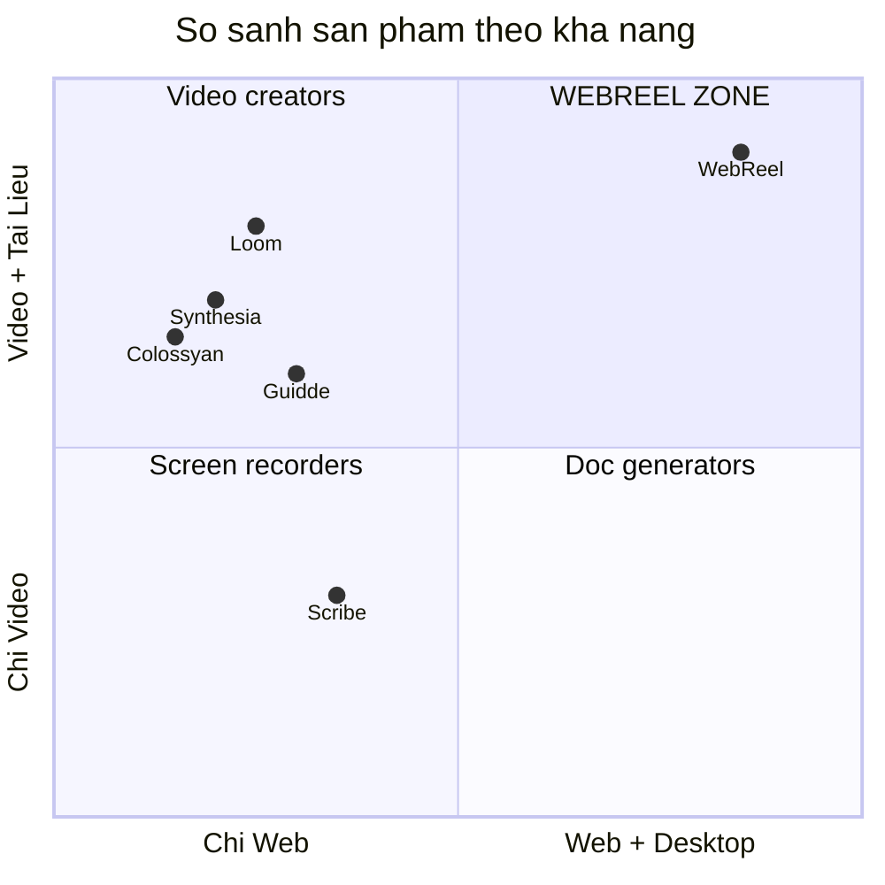
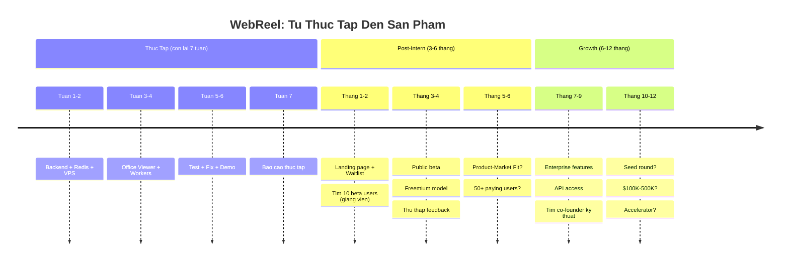

# Dinh Gia San Pham WebReel & Tiem Nang SaaS

## 1. San pham WebReel lam duoc gi?

Khi hoan thanh, WebReel se co **3 kha nang doc nhat**:

| Kha nang | Mo ta | Doi thu co khong? |
|---|---|---|
| **Quay video bai giang tu PPTX** | Upload file -> AI doc slide -> tu dong quay video co giong doc | Synthesia (avatar gia), Guidde (chi web) |
| **Quay video huong dan ung dung desktop** | Chi can noi "huong dan tao bang Excel" -> AI tu lam va quay | **KHONG CO AI LAM DUOC DIEU NAY** |
| **Xuat tai lieu doc (DOCX/PDF) kem video** | Moi buoc co screenshot + mo ta -> tai lieu hoan chinh | Scribe (chi web, khong co video) |

---

## 2. Ban do doi thu canh tranh

### Chi tiet doi thu

| Doi thu | Gia | Lam duoc | KHONG lam duoc |
|---|---|---|---|
| **Synthesia** ($2.1B valuation) | $18-29/thang | Video AI avatar doc script | Khong quay man hinh that, khong demo app |
| **Colossyan** ($54M raised) | $19-27/thang | Video AI avatar | Giong Synthesia, khong quay that |
| **Guidde** ($14M raised) | $18-25/thang | Quay web + AI voiceover | Chi web, khong desktop, khong tai lieu |
| **Scribe** ($75M raised, unicorn-track) | $12-29/thang | Chup screenshot web + tao docs | Khong co video, chi web |
| **Loom** (acq. by Atlassian $975M) | $12.50/thang | Quay man hinh + webcam | Khong tu dong, nguoi phai tu lam |
| **WebReel** | Chua dinh gia | Quay tu dong web + desktop + tai lieu | Chua san sang production |

### WebReel co gi ma ho khong co?

1. **Quay THUC tren ung dung THAT** - Synthesia/Colossyan chi dung AI avatar doc script, khong co man hinh ung dung that. WebReel THUC SU mo Excel, click, go phim, quay lai qua trinh do.

2. **Dual Output: Video + Tai lieu** - Khong doi thu nao tra ve CẢ video LAN tai lieu DOCX/PDF. Scribe chi co tai lieu, Loom chi co video.

3. **Ho tro Desktop Apps** - Guidde va Scribe chi hoat dong tren web. WebReel quay duoc Excel, Word, PowerPoint, bat ky ung dung Windows nao.

4. **100% tu dong, khong can nguoi** - Loom can nguoi tu quay. WebReel chi can 1 cau lenh, AI tu lam tat ca.

---

## 3. Thi truong

| Chi so | Gia tri |
|---|---|
| Thi truong AI Video Generator toan cau (2024) | **$430-706 trieu** |
| Du kien 2025 | **$716 trieu - $1 ty** |
| Tang truong CAGR | **20-33%/nam** |
| Phan khuc lien quan nhat: AI Tutorial/Training | ~$150-200 trieu |

### Khach hang muc tieu

| Nhom | Nhu cau | San sang tra tien? |
|---|---|---|
| **Truong dai hoc/Giang vien** | Tao video bai giang tu slide co san | Cao (ngan sach giao duc) |
| **Phong dao tao doanh nghiep** | Video huong dan quy trinh noi bo (Excel, ERP, CRM) | Rat cao |
| **Cong ty phan mem "nha lam"** | Tao docs + video huong dan cho phan mem cua ho | Rat cao |
| **Freelancer/Content Creator** | Tao video huong dan nhanh | Trung binh |
| **Technical Writer** | Tu dong hoa viet tai lieu | Cao |

> **Diem nhan:** Nhom "Cong ty phan mem nha lam" la **blue ocean** chua ai phuc vu. Ho can tao tai lieu huong dan cho san pham cua ho, nhung khong du nguon luc de quay video thu cong.

---

## 4. Dinh gia san pham

### Giai doan hien tai: Pre-Revenue (chua co doanh thu)

| Phuong phap dinh gia | Gia tri uoc tinh |
|---|---|
| **Cost-based** (chi phi phat trien) | $15K-25K (thoi gian + API costs) |
| **Comparable** (so voi Scribe/Guidde seed round) | $50K-150K |
| **Scorecard** (team, idea, prototype, market) | $80K-200K |

**Giai thich:**
- Du an chua co user tra tien -> chua the tinh theo revenue
- Nhung da co **working prototype** (pipeline hoat dong, da test nhieu)
- Co **loi the ky thuat doc nhat** (OS automation + dual output)
- Team 1 nguoi (intern) -> giam diem scorecard

### Neu dat duoc Product-Market Fit

| Milestone | Dinh gia uoc tinh |
|---|---|
| 50 user tra phi, $500 MRR | **$100K-300K** |
| 200 user, $2K MRR, churn <5% | **$300K-800K** |
| 1000 user, $15K MRR | **$1.5M-4.5M** (10-30x ARR) |
| Enterprise contracts, $50K+ MRR | **$5M-15M** |

> **AI Premium:** Startup AI duoc dinh gia cao hon 42% so voi startup thong thuong (10-30x Revenue thay vi 6x).

---

## 5. Mo hinh SaaS - Co kha thi khong?

### Tra loi ngan: **CO, rat kha thi.**

### Mo hinh gia de xuat

| Goi | Gia/thang | Bao gom | Doi tuong |
|---|---|---|---|
| **Free** | $0 | 3 video/thang, watermark, 720p | Sinh vien, thu nghiem |
| **Starter** | $9 | 15 video/thang, 1080p, khong watermark | Giang vien ca nhan |
| **Pro** | $19 | 50 video/thang, DOCX/PDF export, API access | Phong dao tao |
| **Business** | $49 | Unlimited, priority queue, custom branding, OS demo | Cong ty phan mem |
| **Enterprise** | Lien he | On-premise deploy, SLA, SSO | Doanh nghiep lon |

### Unit Economics uoc tinh

| Chi so | Gia tri |
|---|---|
| Chi phi tao 1 video (Gemini + TTS + compute) | ~$0.01-0.05 |
| Gia ban 1 video (Pro plan, 50 video/$19) | ~$0.38 |
| **Gross Margin** | **~90-95%** |
| CAC uoc tinh (SEO + content marketing) | $10-30 |
| LTV/CAC ratio (neu churn 5%) | 6-15x (rat tot) |

> **Margin 90%+** la dac trung cua SaaS tot. Chi phi bien (Gemini API, TTS, compute) rat thap.

---

## 6. SWOT Analysis

### Diem Manh (Strengths)
- Kha nang doc nhat: quay desktop app tu dong (khong doi thu)
- Dual output (video + tai lieu) - gia tri gap doi
- Chi phi van hanh cuc thap (~$5/thang)
- Da co working prototype, pipeline da tinh chinh ky

### Diem Yeu (Weaknesses)
- Team 1 nguoi (founder duy nhat)
- Chua co user tra tien
- Phu thuoc Microsoft Office/Windows cho OS pipeline
- Chua co UI web san sang cho end-user

### Co Hoi (Opportunities)
- Thi truong $700M+ tang 20-33%/nam
- "Blue ocean" cho phan khuc desktop app tutorial
- Viet Nam: thi truong EdTech dang bung no
- AI cost giam lien tuc (Gemini Flash giam 10x gia trong 1 nam)

### Thach Thuc (Threats)
- Google/Microsoft co the ra san pham tuong tu
- Doi thu giu valuation > $50M co the them tinh nang desktop
- Anti-bot cua Microsoft co the thay doi bat ky luc nao
- Phu thuoc vao API ben thu 3 (Gemini, Edge TTS)

---

## 7. Lo trinh tu Intern Project den Startup

### Cac moc quan trong

| Moc | Dieu kien | Gia tri |
|---|---|---|
| **V0: Demo** | Pipeline chay o Vien, co video mau | $0 (do an thuc tap) |
| **V1: MVP** | Landing page, 10 beta user, feedback | $30K-50K |
| **V2: PMF** | 50+ user tra phi, churn < 10% | $100K-300K |
| **V3: Growth** | 500+ user, $5K+ MRR | $500K-1.5M |
| **V4: Scale** | 2000+ user, $20K+ MRR, team 3-5 nguoi | $2M-6M |

---

## 8. Ket luan

### WebReel dang gia bao nhieu?

- **Hien tai (prototype):** ~$50K-150K (co IP ky thuat doc nhat, co working code)
- **Neu co 50 user tra phi:** $100K-300K
- **Neu co 1000 user tra phi:** $1.5M-4.5M

### Co kha nang lam SaaS khong?

**CO, va day la mot trong nhung loai SaaS tot nhat:**
- Gross margin 90%+ (chi phi bien gan = 0)
- Recurring revenue (user tra hang thang)
- Network effect nhe (cang nhieu video -> cang nhieu data hoc)
- Moat ky thuat (OS automation rat kho lam, can kinh nghiem nhieu nam)

### Loi khuyen cuoi cung

> **Uu tien so 1:** Chung minh nguoi ta SAN SANG TRA TIEN cho san pham nay. 10 giang vien tra $9/thang = $90/thang = bang chung Product-Market Fit manh hon bat ky bai phan tich nao.
