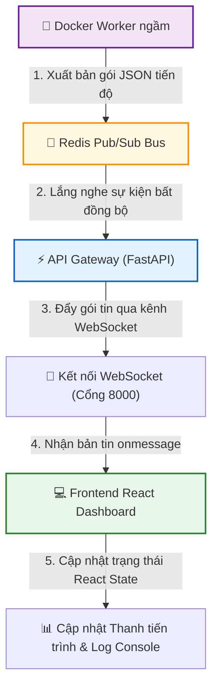
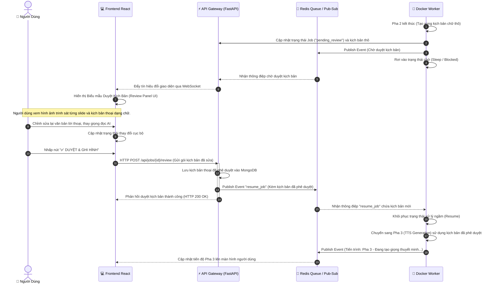

# TÀI LIỆU THIẾT KẾ GIAO DIỆN NGƯỜI DÙNG VÀ LUỒNG TƯƠNG TÁC HỆ THỐNG WEBREEL (FRONTEND DASHBOARD DESIGN)

Tài liệu này mô tả chi tiết về thiết kế giao diện người dùng (User Interface) và luồng tương tác (Interactive Flows) của phân hệ Web Dashboard tập trung trong hệ thống WebReel. Phân hệ này đóng vai trò là trạm điều khiển trung tâm giúp người dùng và quản trị viên giao tiếp, kiểm soát toàn bộ cụm vi dịch vụ thực thi (Workers, Redis, FastAPI, Session Manager) chạy ngầm phía sau. Tài liệu được viết hoàn toàn bằng tiếng Việt và không chứa mã nguồn.

---

## 1. KIẾN TRÚC BẢNG ĐIỀU KHIỂN TẬP TRUNG (CENTRALIZED WEB DASHBOARD)

Giao diện Web Dashboard của WebReel được xây dựng dưới dạng ứng dụng trang đơn (Single Page Application - SPA) có tính phản hồi cao, chia thành 4 phân khu chức năng trực quan trên cùng một màn hình làm việc hoặc thông qua thanh điều hướng (Sidebar).

### 1.1. Sơ đồ bố cục giao diện (Dashboard Layout Wireframe)

Dưới đây là sơ đồ phác thảo bố cục giao diện bảng điều khiển tập trung giúp người dùng kiểm soát toàn bộ vòng đời tác vụ:

```
+-----------------------------------------------------------------------------------------+
|  LOGO WEBREEL  |  DANH SÁCH DỰ ÁN (PROJECTS LIST)          |  👤 TÀI KHOẢN (PRO TIER)   |
+-----------------------------------------------------------------------------------------+
| (Sidebar)      | (Phân Khu Trung Tâm)                                                   |
|                |                                                                        |
| [➕ Tạo Mới]    |  [PHÂN KHU 1: KHỞI TẠO TÁC VỤ (JOB INITIALIZATION)]                     |
|                |  +------------------------------------------------------------------+  |
| [📊 Dashboard] |  | Chế độ: [🌐 Web Tutorial] [📁 Slide-to-Video] [🖥️ Windows Desktop]  |  |
|                |  | URL Web: [_______________________________________________________]  |  |
| [📂 Học Liệu]  |  | Tệp slide: [ Kéo thả tệp PPTX/PDF vào đây để tải lên ]               |  |
|                |  | Giọng đọc AI: (v) Minh Quang (Nam)  | Bộ phát TTS: (v) Edge TTS     |  |
| [🔑 noVNC Portal] | | Tùy chọn: [x] Duyệt lại kịch bản thuyết minh trước khi ghi hình     |  |
|                |  |                                                 [🚀 GỬI YÊU CẦU] |  |
| [⚙️ Cài Đặt]   |  +------------------------------------------------------------------+  |
|                |                                                                        |
|                |  [PHÂN KHU 2: TRÌNH GIÁM SÁT TIẾN ĐỘ THỜI GIAN THỰC (PROGRESS MONITOR)]|
|                |  +------------------------------------------------------------------+  |
|                |  | Đang chạy Job: Hướng dẫn tạo tài khoản Github (job_8f9a2c4e...)  |  |
|                |  | Tiến độ: [===============================>-----------] 72%          |  |
|                |  | Hiện tại: Pha 5 - Thực thi ghi hình trên trình duyệt ảo (Execution) |  |
|                |  | +--------------------------------------------------------------+ |  |
|                |  | | [14:50:12] [Worker] Bắt đầu khởi động Chromium ảo qua Xvfb.. | |  |
|                |  | | [14:50:15] [Worker] AI trinh sát gọi save_narration slide 1  | |  |
|                |  | | [14:50:20] [Execution] Bắt đầu quay hình và tái hiện bước 1..| |  |
|                |  | +--------------------------------------------------------------+ |  |
|                |  +------------------------------------------------------------------+  |
|                |                                                                        |
|                |  [PHÂN KHU 3: KHO LƯU TRỮ HỌC LIỆU THÀNH PHẨM (LIBRARY)]               |
|                |  +------------------------------------------------------------------+  |
|                |  | [🎥 Video_Github.mp4] (Xem / Tải về) | [📄 Ketqua_Excel.xlsx] (Tải)   |  |
|                |  | [🎥 Slide_TienTe.mp4] (Xem / Tải về) | [📄 Baocao_Word.pdf] (Tải về)  |  |
|                |  +------------------------------------------------------------------+  |
+-----------------------------------------------------------------------------------------+
```

---

### 1.2. Mô tả chi tiết 4 phân khu nghiệp vụ

1.  **Phân Khu 1: Khởi tạo Tác vụ (Job Initialization Panel):**
    - _Nghiệp vụ:_ Cung cấp biểu mẫu đầu vào linh hoạt. Người dùng có thể paste URL trang web cần hướng dẫn, kéo thả tệp tài liệu PPTX/PDF từ máy tính, lựa chọn giọng nói AI phù hợp với ngữ cảnh giảng dạy và cấu hình bật/tắt chế độ duyệt kịch bản (Phase 2.5 Review).
2.  **Phân Khu 2: Trình giám sát tiến độ thời gian thực (Progress Monitor):**
    - _Nghiệp vụ:_ Khi một Job được khởi chạy, phân khu này tự động kích hoạt. Nó hiển thị một thanh tiến trình đồ họa (Progress Bar), làm nổi bật pha hiện tại trong 7 pha xử lý (từ Pha 0 đến Pha 6) và nhúng một cửa sổ dòng lệnh (Terminal-style Log Console) tự động cuộn (auto-scroll) hiển thị toàn bộ các bản ghi nhật ký hoạt động chi tiết gửi về từ Worker.
3.  **Phân Khu 3: Kho Lưu trữ Học liệu Thành phẩm (Study Material Repository):**
    - _Nghiệp vụ:_ Hiển thị danh sách lưới (Grid View) các video bài giảng đã dựng thành công. Tích hợp sẵn trình phát video HTML5 Player kết nối trực tiếp với đường dẫn ký sẵn (Presigned URL) của Cloudflare R2 CDN để xem trực tiếp không giật lag. Đồng thời hiển thị các nút tải nhanh tệp tài liệu đi kèm (DOCX, PDF).
4.  **Phân Khu 4: Trạm Quản lý Phiên của Admin (noVNC Portal Integration):**
    - _Nghiệp vụ:_ Dành riêng cho tài khoản có quyền Admin. Phân khu này nhúng một cửa sổ đồ họa thông qua thẻ Iframe trỏ tới cổng 6080 của Session Manager. Admin có thể trực tiếp click chuột, gõ phím từ xa trên giao diện noVNC để duy trì trạng thái đăng nhập của các tài khoản OneDrive/Google Slides trên Chrome mà không cần rời khỏi trang Dashboard.

---

## 2. LUỒNG GIAO TIẾP ĐỒNG BỘ TIẾN ĐỘ QUA WEBSOCKET/SSE

Để hiển thị chính xác % tiến độ, thay đổi pha hiện tại và các dòng logs hoạt động của Worker lên màn hình người dùng theo thời gian thực mà không gây quá tải hàng chục ngàn yêu cầu HTTP Request liên tục tới cơ sở dữ liệu (Polling Degradation), WebReel thiết kế **Giải pháp đồng bộ tiến độ thời gian thực qua kết nối hai chiều WebSocket**.

### 2.1. Quy trình giao tiếp 5 bước của luồng đồng bộ tiến độ



#### Mô tả chi tiết các bước trong luồng giao tiếp:

1.  **Bước 1 - Worker xuất bản gói JSON:** Trong quá trình xử lý tác vụ, mỗi khi chuyển pha hoặc thực hiện một thao tác ghi hình thành công, Worker đóng gói thông tin tiến trình thành một gói tin JSON chuẩn (chứa `current_phase`, `phase_name`, `message` và `logs`) rồi xuất bản (Publish) lên kênh Redis Pub/Sub chuyên biệt có tên khóa là `job:{job_id}:progress`.
2.  **Bước 2 - FastAPI lắng nghe bất đồng bộ:** FastAPI Backend duy trì một tác vụ lắng nghe ngầm bất đồng bộ (Async Redis Subscription). Khi phát hiện có thông điệp mới xuất hiện trên kênh Pub/Sub, FastAPI ngay lập tức thu nhận gói tin mà không cần truy vấn vào cơ sở dữ liệu MongoDB.
3.  **Bước 3 - Đẩy qua kết nối WebSocket:** FastAPI xác định kết nối WebSocket đang hoạt động tương ứng với mã `job_id` đó và đẩy (Push) thông điệp trực tiếp xuống cổng kết nối WebSocket của trình duyệt người dùng.
4.  **Bước 4 - Trình duyệt nhận sự kiện `onmessage`:** Ứng dụng Frontend React đang mở kết nối WebSocket bắt được sự kiện nhận tin nhắn (`onmessage`), giải nén gói tin JSON tiến độ.
5.  **Bước 5 - Cập nhật giao diện tức thời:** Frontend cập nhật dữ liệu tiến độ vào trạng thái (React State). Thanh tiến trình đồ họa tự động chuyển đổi % tương ứng, nhãn mô tả pha hiện tại cập nhật tiếng Việt và dòng log mới được chèn thêm vào cuối Log Console, tự động cuộn màn hình xuống dưới cùng để người dùng theo dõi không độ trễ.

---

## 3. THIẾT KẾ ĐIỂM DỪNG KIỂM DUYỆT PHÂN TÁN (PHASE 2.5 INTERACTIVITY)

Khi người dùng kích hoạt tùy chọn "Duyệt kịch bản thuyết minh" khi khởi tạo Job, hệ thống sẽ chèn thêm một **Điểm dừng kiểm duyệt tương tác phân tán (Phase 2.5 Review Point)** vào giữa quy trình tự động. Điểm dừng này cho phép người dùng đóng vai trò là người hiệu đính cuối cùng, kiểm soát chính xác 100% nội dung chữ và cấu hình âm thanh trước khi hệ thống chạy tiến trình ghi hình thực tế rất nặng ở Pha 5.

### 3.1. Giao diện biểu mẫu kiểm duyệt trực quan (Review Panel UI Design)

Khi Job rơi vào trạng thái `pending_review`, màn hình Dashboard của người dùng sẽ tự động chuyển sang chế độ **Bảng kiểm duyệt kịch bản (Interactive Review Panel)**:

```
+-----------------------------------------------------------------------------------------+
|  [DỰ ÁN ĐANG CHỜ DUYỆT] Hướng dẫn tạo tài khoản Github (job_8f9a2c4e...)               |
+-----------------------------------------------------------------------------------------+
| Cấu hình chung giọng đọc: (v) Minh Quang (Nam)  |  Thời gian đệm slide: [ 300 ] ms       |
+-----------------------------------------------------------------------------------------+
|  DANH SÁCH CÁC BƯỚC THUYẾT MINH AI (EDITABLE SLIDES / STEPS)                             |
|                                                                                         |
|  [Slide 1] [🖼️ Ảnh chụp trinh sát trang chủ Github]                                     |
|  Lời thuyết minh AI tạo ra:                                                             |
|  [ "Chào mừng bạn đến với hướng dẫn tạo tài khoản Github mới nhất năm 2026."        ]   |
|  * Sửa lại: [_________________________________________________________________________] |
|                                                                                         |
|  [Slide 2] [🖼️ Ảnh chụp trinh sát trang đăng ký email]                                    |
|  Lời thuyết minh AI tạo ra:                                                             |
|  [ "Tiếp theo, hãy điền địa chỉ email của bạn vào ô trống và nhấn Continue."        ]   |
|  * Sửa lại: [_________________________________________________________________________] |
|                                                                                         |
|  [Slide 3] [🖼️ Ảnh chụp trinh sát trang điền mật khẩu]                                    |
|  Lời thuyết minh AI tạo ra:                                                             |
|  [ "Bây giờ, bạn hãy nhập mật khẩu bảo mật chứa cả chữ cái và chữ số."              ]   |
|  * Sửa lại: [_________________________________________________________________________] |
|                                                                                         |
|-----------------------------------------------------------------------------------------|
|  [🔴 HỦY BỎ JOB]                                        [💾 LƯU NHÁP]  [✅ DUYỆT & GHI HÌNH] |
+-----------------------------------------------------------------------------------------+
```

---

### 3.2. Sơ đồ tuần tự luồng tương tác phê duyệt kịch bản

Dưới đây là sơ đồ tuần tự mô tả chi tiết cách các thành phần trong cụm vi dịch vụ tương tác và đồng bộ hóa khi đi qua Điểm dừng kiểm duyệt Pha 2.5:



---

### 3.3. Mô tả chi tiết hoạt động của các thành phần trong Luồng Kiểm duyệt

1.  **Hành động của Worker:** Khi hoàn thành Pha 2 (Parser), Worker không tự động chuyển sang Pha 3 ngay lập tức. Nó lưu trữ kịch bản chữ thô và các tệp ảnh chụp màn hình trinh sát của từng slide vào MongoDB, đổi trạng thái bản ghi Job thành `pending_review`, gửi tín hiệu cảnh báo lên Redis Pub/Sub và bắt đầu một vòng lặp kiểm tra (hoặc cơ chế lắng nghe sự kiện bất đồng bộ) trạng thái phê duyệt từ Redis trong trạng thái ngủ đông (Sleep).
2.  **Hành động của Frontend:** Trình lắng nghe WebSocket trên Frontend nhận gói tin `pending_review`. Giao diện React ngay lập tức ẩn thanh tiến trình thô, chuyển đổi màn hình sang dạng Bảng Kiểm Duyệt (Review Panel). Mỗi phần tử dòng thuyết minh được gắn thẻ `<textarea>` cho phép chỉnh sửa văn bản, hiển thị ảnh chụp màn hình trinh sát tương ứng bên cạnh để người dùng có đầy đủ ngữ cảnh trực quan (ví dụ: nhìn thấy ảnh slide 2 thì biết lời thoại slide 2 nên sửa như thế nào).
3.  **Hành động của API Gateway:** Khi người dùng nhấn nút "Duyệt & Ghi hình", dữ liệu lời thoại đã sửa đổi được gửi về FastAPI qua phương thức HTTP POST. API kiểm tra tính hợp lệ của văn bản, ghi đè kịch bản mới vào MongoDB và xuất bản (Publish) một thông điệp sự kiện tiếp tục công việc (`resume_job`) lên Redis Pub/Sub.
4.  **Worker thức giấc và khôi phục:** Worker đang ngủ đông bắt được sự kiện `resume_job` trên Redis, giải nén kịch bản thoại đã được người dùng chỉnh sửa, thức giấc đổi trạng thái Job về `processing` và chuyển tiếp thẳng sang Pha 3 (TTS) để tạo giọng nói AI chính xác theo lời thoại mới phê duyệt. Tiến trình ghi hình diễn ra mượt mà và tự động hoàn toàn ở các pha sau.
